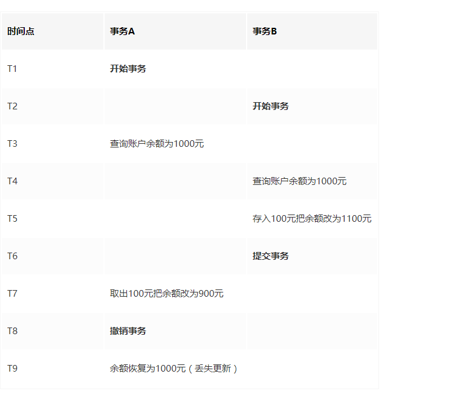
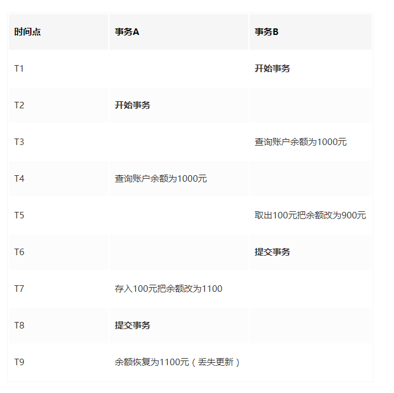
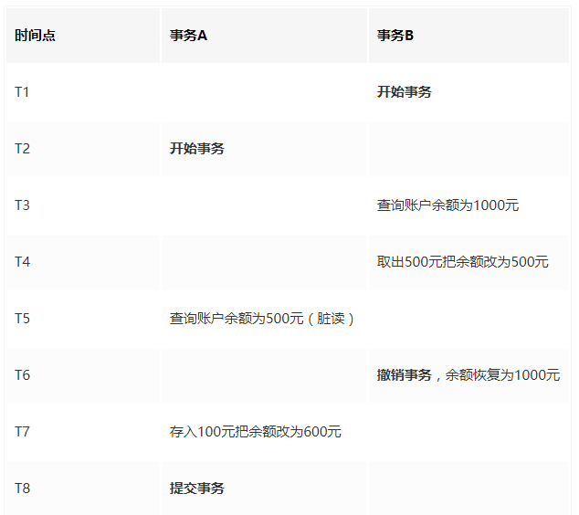
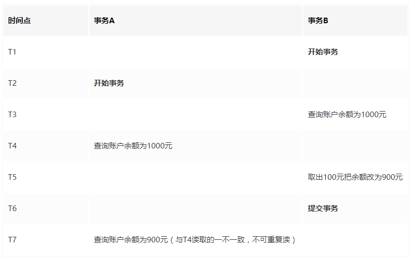
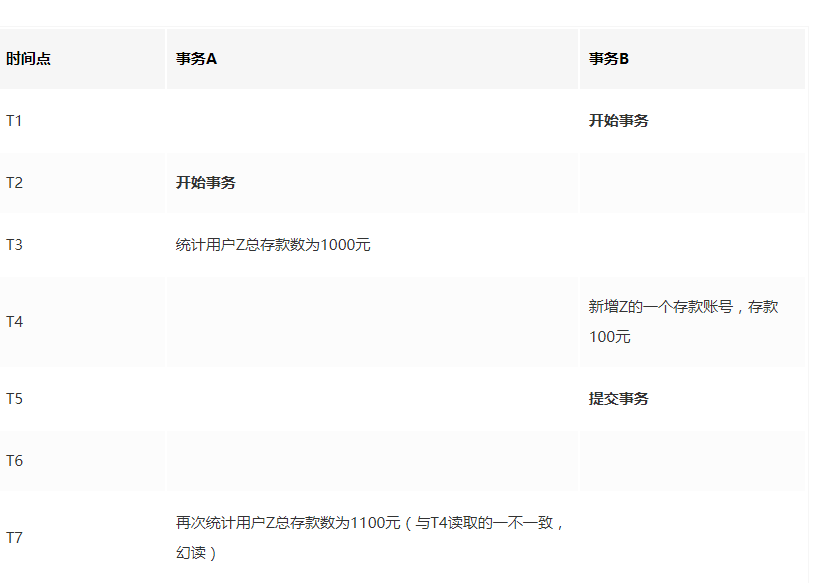

### 事务的四个特征

**ACID**：原子性(Atomicity)、一致性(Consistency)、隔离性(Isolation)和持续性(Durability)

- 原子性(Atomicity)：

> 事务是数据库的逻辑工作单位，不可分割，事务中包含的各操作要么都做，要么都不做。

- 一致性(Consistency):

> ​	事务执行的结果必须是使数据库从一个一致状态变到另一个一致状态。因此当数据库只包含成功的事务提交的结果时，就说数据库处于一致性状态。如果数据库系统运行发生故障，有些事务尚未完成就被迫中断，这些未完成事务对数据库所做的修改有一部分已经写入物理数据库，这时数据库就处于一种不正确的状态，称为不一致状态。

- 隔离性(Isolation)：

> ​	一个事务的执行不能干扰其他事务。即一个事务内部的操作及使用的数据对其他并发事务是隔离的，并发执行的多个事务之间不会互相干扰。

- 持续性(Durability)：

> 也称为永久性，即一个事务一旦提交，它对数据库中的数据改变时永久的，不能回滚。

# 并发事务会产生的问题

-  **丢失更新：**

>  第一类丢失更新： A事务撤销时，把已经提交的B事务的更新数据覆盖了
>
> 
>
> 第二类丢失更新：A事务提交时，把已经提交的B事务的更新数据覆盖了
>
> 

- **脏读**： 读到了未提交更新的数据   

> 

- **不可重复读**：读到已经提交更新的数据，但是一个事务范围内的两次读取结果不一致

> 

- **幻读**：读到已提交插入数据，幻读与不可重复读类似，幻读是查询到了另一个事务已提交的新**插入**数据，不可重复读是查询到另一个事务已提交的**更新**数据

> 

**不可重复读和幻读的区别：** 简单来说，不可重复读是由于数据修改引起的，幻读是由数据插入或者删除引起的。

# 事务的隔离级别

1. Serializable(串行化) 

>  一个事务在执行过程中完全看不到其他事务对数据库所做的更新。当两个事务同时操作数据库中相同数据时，如果第一个事务已经在访问该数据，第二个事务只能停下来等待，必须等到第一个事务结束后才能恢复运行。因此这两个事务实际上是串行化方式运行。

2. Repeatable read(可重复读) 

>  一个事务在执行过程中可以看到其他事务已经提交的插入记录，但是不能看到已经提交的更新记录。

3. Read commited(读已提交)(默认级别) 

> 一个事务在执行过程中可以看到其他事务已经提交的插入记录和更新记录。

4. Read uncommited(读未提交) 

>  一个事务在执行过程中可以看到其他事务没有提交的插入记录和没有提交的更新记录。

四种隔离级别的安全性与性能成反比，Serializable 安全性最高，但是性能最差。

| 隔离级别                     | 第一类丢失更新 | 第二类丢失更新 | 脏读 | 不可重复读 | 幻读 |
| ---------------------------- | :------------: | -------------- | ---- | ---------- | ---- |
| SERIALIZABLE （串行化）      |      避免      | 避免           | 避免 | 避免       | 避免 |
| REPEATABLE READ（可重复读）  |      避免      | 避免           | 避免 | 避免       | 允许 |
| READ COMMITTED （读已提交）  |      避免      | 允许           | 避免 | 允许       | 允许 |
| READ UNCOMMITTED（读未提交） |      避免      | 允许           | 允许 | 允许       | 允许 |

