原文：https://zhuanlan.zhihu.com/p/77383599?utm_source=wechat_session&utm_medium=social&utm_oi=758645373504872448

# 深入理解MySQL索引底层实现原理

## 一、索引的本质

**MySQL官方对索引的定义为**：索引（Index）是帮助MySQL高效获取数据的数据结构。提取句子主干，就可以得到索引的本质：索引是数据结构。

我们知道，数据库查询是数据库的最主要功能之一。我们都希望查询数据的速度能尽可能的快，因此数据库系统的设计者会从查询算法的角度进行优化。最基本的查询算法当然是顺序查找（linear search），这种复杂度为O(n)的算法在数据量很大时显然是糟糕的，好在计算机科学的发展提供了很多更优秀的查找算法，例如二分查找（binary search）、二叉树查找（binary tree search）等。如果稍微分析一下会发现，每种查找算法都只能应用于特定的数据结构之上，例如二分查找要求被检索数据有序，而二叉树查找只能应用于二叉查找树上，但是数据本身的组织结构不可能完全满足各种数据结构（例如，理论上不可能同时将两列都按顺序进行组织），所以，在数据之外，数据库系统还维护着满足特定查找算法的数据结构，这些数据结构以某种方式引用（指向）数据，这样就可以在这些数据结构上实现高级查找算法。这种数据结构，就是索引。

看一个例子：

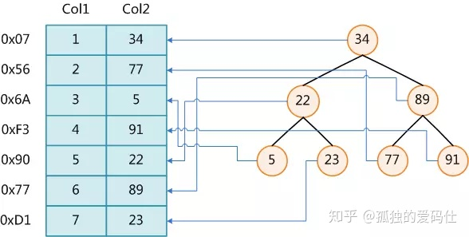

上图展示了一种可能的索引方式。左边是数据表，一共有两列七条记录，最左边的是数据记录的物理地址（注意逻辑上相邻的记录在磁盘上也并不是一定物理相邻的）。为了加快Col2的查找，可以维护一个右边所示的二叉查找树，每个节点分别包含索引键值和一个指向对应数据记录物理地址的指针，这样就可以运用二叉查找在O(logn2)O(log2n)的复杂度内获取到相应数据。

虽然这是一个货真价实的索引，但是实际的数据库系统几乎没有使用二叉查找树或其进化品种红黑树（red-black tree）实现的，原因会在下文介绍。

## 二、二叉排序树

在介绍B树之前，先来看另一棵神奇的树——二叉排序树（Binary Sort Tree），首先它是一棵树，“二叉”这个描述已经很明显了，就是树上的一根树枝开两个叉，于是递归下来就是二叉树了（下图所示），而这棵树上的节点是已经排好序的，**具体的排序规则如下**：

- 若左子树不空，则左子树上所有节点的值均小于它的根节点的值
- 若右子树不空，则右字数上所有节点的值均大于它的根节点的值
- 它的左、右子树也分别为二叉排序数（递归定义）

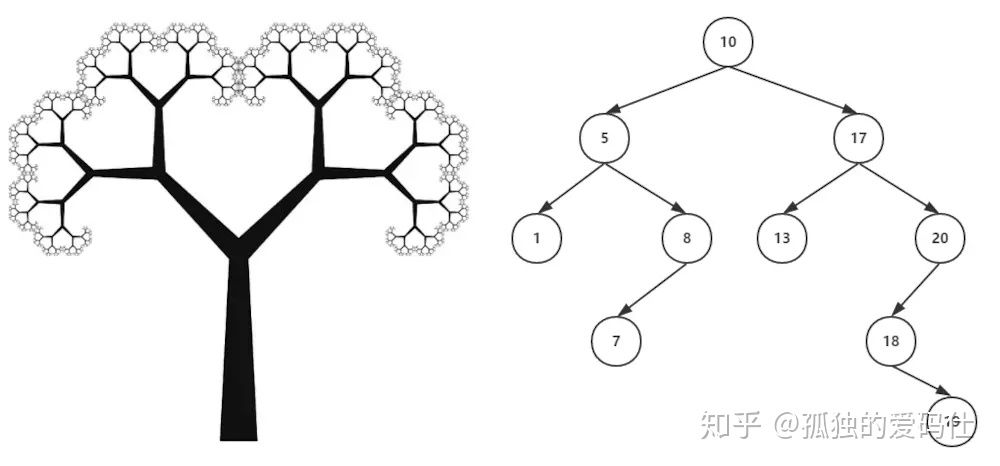

从图中可以看出，二叉排序树组织数据时，用于查找是比较方便的，因为每次经过一次节点时，最多可以减少一半的可能，不过极端情况会出现所有节点都位于同一侧，直观上看就是一条直线，那么这种查询的效率就比较低了，因此需要对二叉树左右子树的高度进行平衡化处理，于是就有了平衡二叉树（Balenced Binary Tree）。

所谓“平衡”，说的是这棵树的各个分支的高度是均匀的，它的左子树和右子树的高度之差绝对值小于1，这样就不会出现一条支路特别长的情况。于是，在这样的平衡树中进行查找时，总共比较节点的次数不超过树的高度，这就确保了查询的效率（时间复杂度为O(logn)）

## 三、B树

还是直接看图比较清楚，图中所示，B树事实上是一种平衡的多叉查找树，也就是说最多可以开m个叉（m>=2），我们称之为m阶b树，为了体现本博客的良心之处，不同于其他地方都能看到2阶B树，这里特意画了一棵5阶B树 。

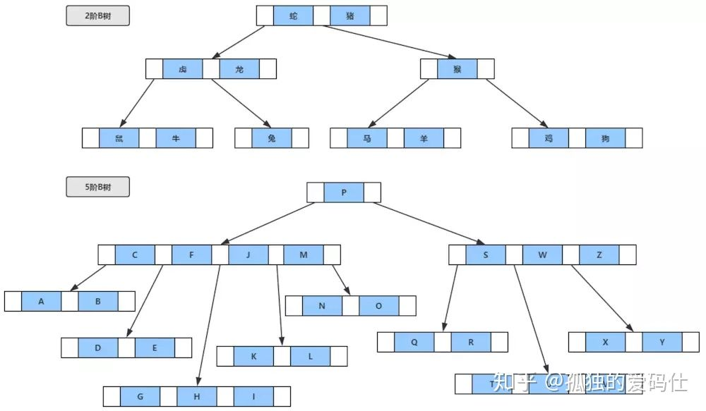

**总的来说，m阶B树满足以下条件**：

- 每个节点至多可以拥有m棵子树。
- 根节点，只有至少有2个节点（要么极端情况，就是一棵树就一个根节点，单细胞生物，即是根，也是叶，也是树)。
- 非根非叶的节点至少有的Ceil(m/2)个子树(Ceil表示向上取整，图中5阶B树，每个节点至少有3个子树，也就是至少有3个叉)。
- 非叶节点中的信息包括[n,A0,K1,A1,K2,A2,…,Kn,An]，，其中n表示该节点中保存的关键字个数，K为关键字且Ki<Ki+1，A为指向子树根节点的指针。
- 从根到叶子的每一条路径都有相同的长度，也就是说，叶子节在相同的层，并且这些节点不带信息，实际上这些节点就表示找不到指定的值，也就是指向这些节点的指针为空。
- B树的查询过程和二叉排序树比较类似，从根节点依次比较每个结点，因为每个节点中的关键字和左右子树都是有序的，所以只要比较节点中的关键字，或者沿着指针就能很快地找到指定的关键字，如果查找失败，则会返回叶子节点，即空指针。

**例如查询图中字母表中的K**：

- 从根节点P开始，K的位置在P之前，进入左侧指针。
- 左子树中，依次比较C、F、J、M，发现K在J和M之间。
- 沿着J和M之间的指针，继续访问子树，并依次进行比较，发现第一个关键字K即为指定查找的值。

B树搜索的简单伪算法如下：

```php
BTree_Search(node, key) {
    if(node == null) return null;
    foreach(node.key)
    {
        if(node.key[i] == key) return node.data[i];
        if(node.key[i] > key) return BTree_Search(point[i]->node);
    }
    return BTree_Search(point[i+1]->node);
}
data = BTree_Search(root, my_key);
```

**B树的特点可以总结为如下**：

- 关键字集合分布在整颗树中。
- 任何一个关键字出现且只出现在一个节点中。
- 搜索有可能在非叶子节点结束。
- 其搜索性能等价于在关键字集合内做一次二分查找。
- B树在插入删除新的数据记录会破坏B-Tree的性质，因为在插入删除时，需要对树进行一个分裂、合并、转移等操作以保持B-Tree性质。

## 四、Plus版 — B+树

作为B树的加强版，B+树与B树的差异在于

有n棵子树的节点含有n个关键字（也有认为是n-1个关键字）。

所有的关键字全部存储在叶子节点上，且叶子节点本身根据关键字自小而大顺序连接。

非叶子节点可以看成索引部分，节点中仅含有其子树（根节点）中的最大（或最小）关键字。

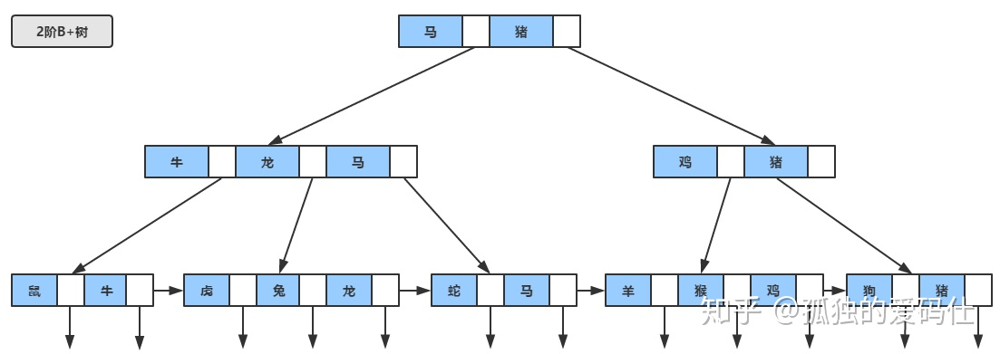

B+树的查找过程，与B树类似，只不过查找时，如果在非叶子节点上的关键字等于给定值，并不终止，而是继续沿着指针直到叶子节点位置。因此在B+树，不管查找成功与否，每次查找都是走了一条从根到叶子节点的路径。

**B+树的特性如下**：

- 所有关键字都存储在叶子节上，且链表中的关键字恰好是有序的。
- 不可能非叶子节点命中返回。
- 非叶子节点相当于叶子节点的索引，叶子节点相当于是存储（关键字）数据的数据层。
- 更适合文件索引系统。

## 五、带有顺序访问指针的B+Tree

一般在数据库系统或文件系统中使用的B+Tree结构都在经典B+Tree的基础上进行了优化，增加了顺序访问指针。

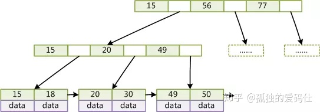

如上图所示，在B+Tree的每个叶子节点增加一个指向相邻叶子节点的指针，就形成了带有顺序访问指针的B+Tree。做这个优化的目的是为了提高区间访问的性能，例如图4中如果要查询key为从18到49的所有数据记录，当找到18后，只需顺着节点和指针顺序遍历就可以一次性访问到所有数据节点，极大提到了区间查询效率。

## 六、MySQL为什么使用B树（B+树）

红黑树等数据结构也可以用来实现索引，但是文件系统以及数据库系统普遍采用B树或者B+树，这一节将结合计算机组成原理相关知识讨论B-/+Tree作为索引的理论基础。

一般来说，索引本身也很大，不可能全部存储在内存中，因此索引往往以索引文件的形式存储在磁盘上。这样的话，索引查找过程中就要产生磁盘I/O消耗，相对于内存存取，I/O存取的消耗要高几个数量级，所以评价一个数据结构作为索引的优劣最重要的指标就是在查找过程中磁盘I/O操作次数的渐进复杂度。换句话说，索引的结构组织要尽量减少查找过程中磁盘I/O的存取次数。下面先介绍内存和磁盘存取原理，然后再结合这些原理分析B-/+Tree作为索引的效率。

## 1. 主存存取原理

目前计算机使用的主存基本都是随机读写存储器（RAM），现代RAM的结构和存取原理比较复杂，这里本文抛却具体差别，抽象出一个十分简单的存取模型来说明RAM的工作原理。

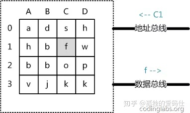

从抽象角度看，主存是一系列的存储单元组成的矩阵，每个存储单元存储固定大小的数据。每个存储单元有唯一的地址，现代主存的编址规则比较复杂，这里将其简化成一个二维地址：通过一个行地址和一个列地址可以唯一定位到一个存储单元。上图展示了一个4 x 4的主存模型。

**主存的存取过程如下**：

- 当系统需要读取主存时，则将地址信号放到地址总线上传给主存，主存读到地址信号后，解析信号并定位到指定存储单元，然后将此存储单元数据放到数据总线上，供其它部件读取。
- 写主存的过程类似，系统将要写入单元地址和数据分别放在地址总线和数据总线上，主存读取两个总线的内容，做相应的写操作。

这里可以看出，主存存取的时间仅与存取次数呈线性关系，因为不存在机械操作，两次存取的数据的“距离”不会对时间有任何影响，例如，先取A0再取A1和先取A0再取D3的时间消耗是一样的。

## 2. 磁盘存取原理

上文说过，索引一般以文件形式存储在磁盘上，索引检索需要磁盘I/O操作。与主存不同，磁盘I/O存在机械运动耗费，因此磁盘I/O的时间消耗是巨大的。

下图是磁盘的整体结构示意图：

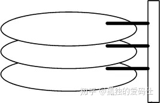

一个磁盘由大小相同且同轴的圆形盘片组成，磁盘可以转动（各个磁盘必须同步转动）。在磁盘的一侧有磁头支架，磁头支架固定了一组磁头，每个磁头负责存取一个磁盘的内容。磁头不能转动，但是可以沿磁盘半径方向运动（实际是斜切向运动），每个磁头同一时刻也必须是同轴的，即从正上方向下看，所有磁头任何时候都是重叠的（不过目前已经有多磁头独立技术，可不受此限制）。

下图是磁盘结构的示意图：

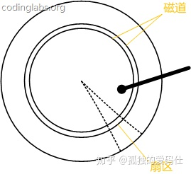

盘片被划分成一系列同心环，圆心是盘片中心，每个同心环叫做一个磁道，所有半径相同的磁道组成一个柱面。磁道被沿半径线划分成一个个小的段，每个段叫做一个扇区，每个扇区是磁盘的最小存储单元。为了简单起见，我们下面假设磁盘只有一个盘片和一个磁头。

当需要从磁盘读取数据时，系统会将数据逻辑地址传给磁盘，磁盘的控制电路按照寻址逻辑将逻辑地址翻译成物理地址，即确定要读的数据在哪个磁道，哪个扇区。为了读取这个扇区的数据，需要将磁头放到这个扇区上方，为了实现这一点，磁头需要移动对准相应磁道，这个过程叫做寻道，所耗费时间叫做寻道时间，然后磁盘旋转将目标扇区旋转到磁头下，这个过程耗费的时间叫做旋转时间。


## 3. 局部性原理与磁盘预读

由于存储介质的特性，磁盘本身存取就比主存慢很多，再加上机械运动耗费，磁盘的存取速度往往是主存的几百分分之一，因此为了提高效率，要尽量减少磁盘I/O。为了达到这个目的，磁盘往往不是严格按需读取，而是每次都会预读，即使只需要一个字节，磁盘也会从这个位置开始，顺序向后读取一定长度的数据放入内存。这样做的理论依据是计算机科学中著名的局部性原理：

当一个数据被用到时，其附近的数据也通常会马上被使用。

所以，程序运行期间所需要的数据通常应当比较集中。

由于磁盘顺序读取的效率很高（不需要寻道时间，只需很少的旋转时间），因此对于具有局部性的程序来说，预读可以提高I/O效率。

预读的长度一般为页（page）的整倍数。页是计算机管理存储器的逻辑块，硬件及操作系统往往将主存和磁盘存储区分割为连续的大小相等的块，每个存储块称为一页（在许多操作系统中，页得大小通常为4k），主存和磁盘以页为单位交换数据。当程序要读取的数据不在主存中时，会触发一个缺页异常，此时系统会向磁盘发出读盘信号，磁盘会找到数据的起始位置并向后连续读取一页或几页载入内存中，然后异常返回，程序继续运行。

## 4. B-/+Tree索引的性能分析

到这里终于可以分析B-/+Tree索引的性能了。

上文说过一般使用磁盘I/O次数评价索引结构的优劣。先从B-Tree分析，根据B-Tree的定义，可知检索一次最多需要访问h个节点。数据库系统的设计者巧妙利用了磁盘预读原理，将一个节点的大小设为等于一个页，这样每个节点只需要一次I/O就可以完全载入。为了达到这个目的，在实际实现B-Tree还需要使用如下技巧：

每次新建节点时，直接申请一个页的空间，这样就保证一个节点物理上也存储在一个页里，加之计算机存储分配都是按页对齐的，就实现了一个node只需一次I/O。

B-Tree中一次检索最多需要h-1次I/O（根节点常驻内存），渐进复杂度为O(h)=O(logdN)O(h)=O(logdN)。一般实际应用中，出度d是非常大的数字，通常超过100，因此h非常小（通常不超过3）。（h表示树的高度 & 出度d表示的是树的度，即树中各个节点的度的最大值）

综上所述，用B-Tree作为索引结构效率是非常高的。

而红黑树这种结构，h明显要深的多。由于逻辑上很近的节点（父子）物理上可能很远，无法利用局部性，所以红黑树的I/O渐进复杂度也为O(h)，效率明显比B-Tree差很多。

上文还说过，B+Tree更适合外存索引，原因和内节点出度d有关。从上面分析可以看到，d越大索引的性能越好，而出度的上限取决于节点内key和data的大小：

```cpp
dmax=floor(pagesize/(keysize+datasize+pointsize))
```

floor表示向下取整。由于B+Tree内节点去掉了data域，因此可以拥有更大的出度，拥有更好的性能。

## 七、MySQL索引实现

在MySQL中，索引属于存储引擎级别的概念，不同存储引擎对索引的实现方式是不同的，本文主要讨论MyISAM和InnoDB两个存储引擎的索引实现方式。

## 1. MyISAM索引实现

MyISAM引擎使用B+Tree作为索引结构，叶节点的data域存放的是数据记录的地址。下图是MyISAM索引的原理图：

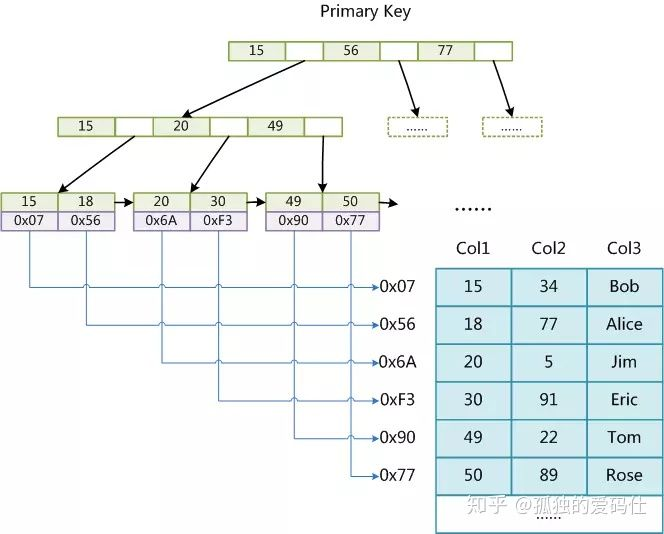

这里设表一共有三列，假设我们以Col1为主键，则上图是一个MyISAM表的主索引（Primary key）示意。可以看出MyISAM的索引文件仅仅保存数据记录的地址。在MyISAM中，主索引和辅助索引（Secondary key）在结构上没有任何区别，只是主索引要求key是唯一的，而辅助索引的key可以重复。如果我们在Col2上建立一个辅助索引，则此索引的结构如下图所示：

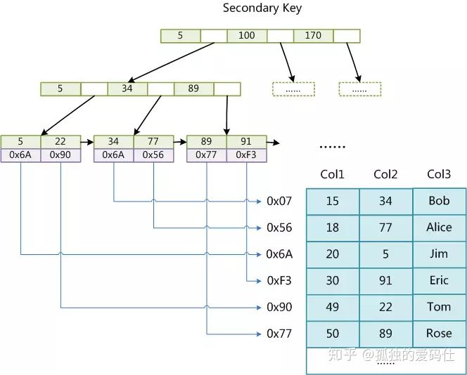

同样是一棵B+树，data域保存数据记录的地址。因此，MyISAM中索引检索的算法为首先按照B+Tree搜索算法搜索索引，如果指定的Key存在，则取出其data域的值，然后以data域的 值为地址，读取相应数据记录。

MyISAM的索引方式也叫做“非聚集”的，之所以这么称呼是为了与InnoDB的聚集索引区分。

## 2. InnoDB索引实现

虽然InnoDB也使用B+Tree作为索引结构，但具体实现方式却与MyISAM截然不同。

第一个重大区别是InnoDB的数据文件本身就是索引文件。从上文知道，MyISAM索引文件和数据文件是分离的，索引文件仅保存数据记录的地址。而在InnoDB中，表数据文件本身就是按B+Tree组织的一个索引结构，这棵树的叶节点data域保存了完整的数据记录。这个索引的key是数据表的主键，因此InnoDB表数据文件本身就是主索引。


上图是InnoDB主索引（同时也是数据文件）的示意图，可以看到叶节点包含了完整的数据记录。这种索引叫做聚集索引。因为InnoDB的数据文件本身要按主键聚集，所以InnoDB要求表必须有主键（MyISAM可以没有），如果没有显式指定，则MySQL系统会自动选择一个可以唯一标识数据记录的列作为主键，如果不存在这种列，则MySQL自动为InnoDB表生成一个隐含字段作为主键，这个字段长度为6个字节，类型为长整型。

第二个与MyISAM索引的不同是InnoDB的辅助索引data域存储相应记录主键的值而不是地址。换句话说，InnoDB的所有辅助索引都引用主键作为data域。例如，上图为定义在Col3上的一个辅助索引：

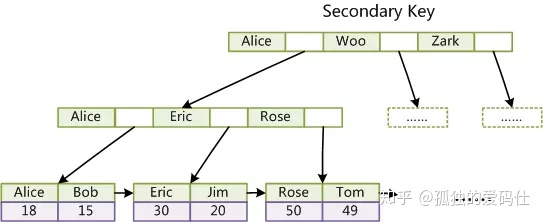

这里以英文字符的ASCII码作为比较准则。聚集索引这种实现方式使得按主键的搜索十分高效，但是辅助索引搜索需要检索两遍索引：首先检索辅助索引获得主键，然后用主键到主索引中检索获得记录。

了解不同存储引擎的索引实现方式对于正确使用和优化索引都非常有帮助，例如知道了InnoDB的索引实现后，就很容易明白为什么不建议使用过长的字段作为主键，因为所有辅助索引都引用主索引，过长的主索引会令辅助索引变得过大。再例如，用非单调的字段作为主键在InnoDB中不是个好主意，因为InnoDB数据文件本身是一棵B+Tree，非单调的主键会造成在插入新记录时数据文件为了维持B+Tree的特性而频繁的分裂调整，十分低效，而使用自增字段作为主键则是一个很好的选择。