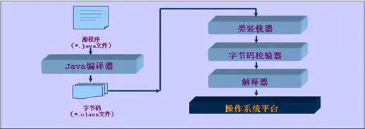
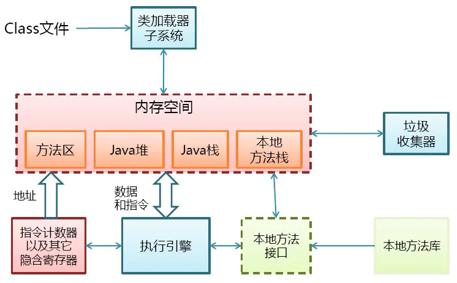
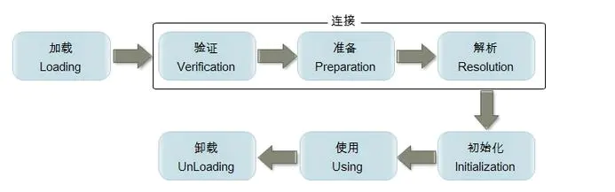

原文: https://juejin.im/post/6844903564804882445

# 概述

在开始正文之前，我们先看两张图 。Java平台的理解？Java最显著的特性？Java是解释执行？ 先看一下java程序的执行流程图



再看一下jvm的大致物理结构图





本文是我在学习jvm类加载机制的时候对网上的一些资料的整理和总结。本文将研究一下问题：

什么是类加载？类的加载过程（生命周期）？类什么时候初始化？类初始化顺序？类加载器、反射、字节码等一系列问题。

# 一、类加载机制概念

- Java虚拟机把描述类的数据从Class文件加载到内存，并对数据进行校验、转换解析和初始化，最终形成可以被虚拟机直接使用的Java类型，这就是虚拟机的加载机制。* Class文件由类装载器装载后，在JVM中将形成一份描述Class结构的元信息对象，通过该元信息对象可以获知Class的结构信息：如构造函数，属性和方法等，Java允许用户借由这个Class相关的元信息对象间接调用Class对象的功能,这里就是我们经常能见到的Class类。

# 二、类加载过程





工作机制

类装载器就是寻找类的字节码文件，并构造出类在JVM内部表示的对象组件。在Java中，类装载器把一个类装入JVM中，要经过以下步骤：

```
  (1) 装载：查找和导入Class文件；

  (2) 链接：把类的二进制数据合并到JRE中；

     (a)校验：检查载入Class文件数据的正确性；

     (b)准备：给类的静态变量分配存储空间；

     (c)解析：将符号引用转成直接引用；

  (3) 初始化：对类的静态变量，静态代码块执行初始化操作
复制代码
```

Java程序可以动态扩展是由运行期动态加载和动态链接实现的；比如：如果编写一个使用接口的应用程序，可以等到运行时再指定其实际的实现(多态)，解析过程有时候还可以在初始化之后执行；比如：动态绑定(多态) 如上图所示，加载、验证、准备、初始化和卸载这五个阶段的顺序是确定的，类的加载过程必须按照这个顺序来按部就班地开始，而解析阶段则不一定，它在某些情况下可以在初始化阶段后再开始。 类的生命周期的每一个阶段通常都是互相交叉混合式进行的，通常会在一个阶段执行的过程中调用或激活另外一个阶段。

在我参考别人的资料的时候，发现都是先介绍的类的初始化这个过程，但是我觉得这样会造成一种误解什么事类的初始化，和它应该发生的时机。这里我就按照类的加载生命周期顺序介绍每一个过程了。

**1. 装载(加载)**

类的装载指的是将类的.class文件中的二进制数据读入到内存中，将其放在运行时数据区的方法区内，然后在堆区创建一个java.lang.Class对象，用来封装类在方法区内的数据结构。类的加载的最终产品是位于堆区中的Class对象，Class对象封装了类在方法区内的数据结构，并且向Java程序员提供了访问方法区内的数据结构的接口。

类加载器并不需要等到某个类被“首次主动使用”时再加载它，JVM规范允许类加载器在预料某个类将要被使用时就预先加载它，如果在预先加载的过程中遇到了.class文件缺失或存在错误，类加载器必须在程序首次主动使用该类时才报告错误（LinkageError错误）如果这个类一直没有被程序主动使用，那么类加载器就不会报告错误。

加载.class文件的方式有:

1). 从本地系统中直接加载 2). 通过网络下载.class文件 3). 从zip，jar等归档文件中加载.class文件 4). 从专有数据库中提取.class文件 5). 将Java源文件动态编译为.class文件

在了解了什么是类的加载后，回头来再看jvm进行类加载阶段都做了什么。虚拟机需要完成以下三件事情：

1).通过一个类的全限定名称来获取定义此类的二进制字节流。

2).将这个字节流所代表的静态存储结构转化为方法区的运行时数据结构。

3).在java堆中生成一个代表这个类的java.lang.Class对象，作为方法区这些数据的访问入口。

相对于类加载过程的其他阶段，加载阶段是开发期相对来说可控性比较强，该阶段既可以使用系统提供的类加载器完成，也可以由用户自定义的类加载器来完成，开发人员可以通过定义自己的类加载器去控制字节流的获取方式。关于这个过程的更多细节，我会在下一节细说，类的加载。 加载阶段完成后，虚拟机外部的 二进制字节流就按照虚拟机所需的格式存储在方法区之中，而且在Java堆中也创建一个java.lang.Class类的对象，这样便可以通过该对象访问方法区中的这些数据。

**2. 验证**

验证的目的是为了确保Class文件中的字节流包含的信息符合当前虚拟机的要求，而且不会危害虚拟机自身的安全。不同的虚拟机对类验证的实现可能会有所不同，但大致都会完成以下四个阶段的验证：文件格式的验证、元数据的验证、字节码验证和符号引用验证。

1）文件格式的验证：验证字节流是否符合Class文件格式的规范，并且能被当前版本的虚拟机处理，该验证的主要目的是保证输入的字节流能正确地解析并存储于方法区之内。经过该阶段的验证后，字节流才会进入内存的方法区中进行存储，后面的三个验证都是基于方法区的存储结构进行的。

2）元数据验证：对类的元数据信息进行语义校验（其实就是对类中的各数据类型进行语法校验），保证不存在不符合Java语法规范的元数据信息。

3）字节码验证：该阶段验证的主要工作是进行数据流和控制流分析，对类的方法体进行校验分析，以保证被校验的类的方法在运行时不会做出危害虚拟机安全的行为。

4）符号引用验证：这是最后一个阶段的验证，它发生在虚拟机将符号引用转化为直接引用的时候（解析阶段中发生该转化，后面会有讲解），主要是对类自身以外的信息（常量池中的各种符号引用）进行匹配性的校验。

**3. 准备**

准备阶段是正式为类变量分配内存并设置类变量初始值的阶段，这些内存都将在方法区中进行分配。 注：

1）这时候进行内存分配的仅包括类变量（static），而不包括实例变量，实例变量会在对象实例化时随着对象一块分配在Java堆中。

2）这里所设置的初始值通常情况下是数据类型默认的零值（如0、0L、null、false等），而不是被在Java代码中被显式地赋予的值。

**4. 解析**

解析阶段是虚拟机将常量池内的符号引用替换为直接引用的过程。

符号引用（Symbolic Reference）：符号引用以一组符号来描述所引用的目标，符号引用可以是任何形式的字面量，符号引用与虚拟机实现的内存布局无关，引用的目标并不一定已经在内存中。

直接引用（Direct Reference）：直接引用可以是直接指向目标的指针、相对偏移量或是一个能间接定位到目标的句柄。直接引用是与虚拟机实现的内存布局相关的，同一个符号引用在不同的虚拟机实例上翻译出来的直接引用一般都不相同，如果有了直接引用，那引用的目标必定已经在内存中存在。

1)、类或接口的解析：判断所要转化成的直接引用是对数组类型，还是普通的对象类型的引用，从而进行不同的解析。 2)、字段解析：对字段进行解析时，会先在本类中查找是否包含有简单名称和字段描述符都与目标相匹配的字段，如果有，则查找结束；如果没有，则会按照继承关系从上往下递归搜索该类所实现的各个接口和它们的父接口，还没有，则按照继承关系从上往下递归搜索其父类，直至查找结束。

3)、类方法解析：对类方法的解析与对字段解析的搜索步骤差不多，只是多了判断该方法所处的是类还是接口的步骤，而且对类方法的匹配搜索，是先搜索父类，再搜索接口。

4)、接口方法解析：与类方法解析步骤类似，只是接口不会有父类，因此，只递归向上搜索父接口就行了。

**5. 初始化**

类初始化阶段是类加载过程的最后一步，前面的类加载过程中，除了加载（Loading）阶段用户应用程序可以通过自定义类加载器参与之外，其余动作完全由虚拟机主导和控制。到了初始化阶段，才真正开始执行类中定义的Java程序代码。 初始化，为类的静态变量赋予正确的初始值，JVM负责对类进行初始化，主要对类变量进行初始化。在Java中对类变量进行初始值设定有两种方式：

①声明类变量时指定初始值

②使用静态代码块为类变量指定初始值

JVM初始化步骤

1)、假如这个类还没有被加载和连接，则程序先加载并连接该类

2)、假如该类的直接父类还没有被初始化，则先初始化其直接父类

3)、假如类中有初始化语句，则系统依次执行这些初始化语句

初始化阶段时执行类构造器方法()的过程。

1）类构造器方法是由编译器自动收集类中的所有类变量的赋值动作和静态语句块（static{}块）中的语句合并产生的，编译器收集的顺序由语句在源文件中出现的顺序所决定。

2）类构造器方法与类的构造函数不同，它不需要显式地调用父类构造器，虚拟机会保证在子类的类构造器方法执行之前，父类的类构造器方法已经执行完毕，因此在虚拟机中第一个执行的类构造器方法的类一定是java.lang.Object。

3）由于父类的类构造器方法方法先执行，也就意味着父类中定义的静态语句块要优先于子类的变量赋值操作。

4）类构造器方法对于类或者接口来说并不是必需的，如果一个类中没有静态语句块也没有对变量的赋值操作，那么编译器可以不为这个类生成类构造器方法。

5）接口中可能会有变量赋值操作，因此接口也会生成类构造器方法。但是接口与类不同，执行接口的类构造器方法不需要先执行父接口的类构造器方法。只有当父接口中定义的变量被使用时，父接口才会被初始化。另外，接口的实现类在初始化时也不会执行接口的类构造器方法。

6）虚拟机会保证一个类的类构造器方法在多线程环境中被正确地加锁和同步。如果有多个线程去同时初始化一个类，那么只会有一个线程去执行这个类的类构造器方法，其它线程都需要阻塞等待，直到活动线程执行类构造器方法完毕。如果在一个类的类构造器方法中有耗时很长的操作，那么就可能造成多个进程阻塞。

**6.结束生命周期**

在以下情况的时候，Java虚拟机会结束生命周期 1). 执行了System.exit()方法 2). 程序正常执行结束 3). 程序在执行过程中遇到了异常或错误而异常终止 4). 由于操作系统出现错误而导致Java虚拟机进程终止

# 三、 何时开始类的初始化

什么情况下需要开始类加载过程的第一个阶段:"加载"。虚拟机规范中并没强行约束，这点可以交给虚拟机的的具体实现自由把握，但是对于初始化阶段虚拟机规范是严格规定了如下几种情况，如果类未初始化会对类进行初始化。

1、创建类的实例

2、访问类的静态变量(除常量【被final修辞的静态变量】原因:常量一种特殊的变量，因为编译器把他们当作值(value)而不是域(field)来对待。如果你的代码中用到了常变量(constant variable)，编译器并不会生成字节码来从对象中载入域的值，而是直接把这个值插入到字节码中。这是一种很有用的优化，但是如果你需要改变final域的值那么每一块用到那个域的代码都需要重新编译。

3、访问类的静态方法

4、反射如(Class.forName("my.xyz.Test"))

5、当初始化一个类时，发现其父类还未初始化，则先出发父类的初始化

6、虚拟机启动时，定义了main()方法的那个类先初始化

以上情况称为称对一个类进行“主动引用”，除此种情况之外，均不会触发类的初始化，称为“被动引用” 接口的加载过程与类的加载过程稍有不同。接口中不能使用static{}块。当一个接口在初始化时，并不要求其父接口全部都完成了初始化，只有真正在使用到父接口时（例如引用接口中定义的常量）才会初始化。

**被动引用例子**

1、子类调用父类的静态变量，子类不会被初始化。只有父类被初始化。。对于静态字段，只有直接定义这个字段的类才会被初始化.

2、通过数组定义来引用类，不会触发类的初始化

3、 访问类的常量，不会初始化类

```
class SuperClass {  
    static {  
        System.out.println("superclass init");  
    }  
    public static int value = 123;  
}  
  
class SubClass extends SuperClass {  
    static {  
        System.out.println("subclass init");  
    }  
}  
  
public class Test {  
    public static void main(String[] args) {  
        System.out.println(SubClass.value);// 被动应用1  
        SubClass[] sca = new SubClass[10];// 被动引用2  
    }  
}  
复制代码
```

程序运行输出    superclass init 123 从上面的输入结果证明了被动引用1与被动引用2

```
class ConstClass {  
    static {  
        System.out.println("ConstClass init");  
    }  
    public static final String HELLOWORLD = "hello world";  
}  
  
public class Test {  
    public static void main(String[] args) {  
        System.out.println(ConstClass.HELLOWORLD);// 调用类常量  
    }  
}  
复制代码
```

程序输出结果 hello world 从上面的输出结果证明了被动引用3

** 题目分析**

上面很详细的介绍了类的加载时机和类的加载过程，通过上面的理论来分析本文开门见上的题目

```
class SingleTon {  
    private static SingleTon singleTon = new SingleTon();  
    public static int count1;  
    public static int count2 = 0;  
  
    private SingleTon() {  
        count1++;  
        count2++;  
    }  
  
    public static SingleTon getInstance() {  
        return singleTon;  
    }  
}  
  
public class Test {  
    public static void main(String[] args) {  
        SingleTon singleTon = SingleTon.getInstance();  
        System.out.println("count1=" + singleTon.count1);  
        System.out.println("count2=" + singleTon.count2);  
    }  
}  
复制代码
```

分析:

1:SingleTon singleTon = SingleTon.getInstance();调用了类的SingleTon调用了类的静态方法，触发类的初始化

2:类加载的时候在准备过程中为类的静态变量分配内存并初始化默认值 singleton=null count1=0,count2=0

3:类初始化化，为类的静态变量赋值和执行静态代码快。singleton赋值为new SingleTon()调用类的构造方法

4:调用类的构造方法后count=1;count2=1

5:继续为count1与count2赋值,此时count1没有赋值操作,所有count1为1,但是count2执行赋值操作就变为0

# 四、类初始化顺序

现在我们知道什么时候触发类的初始化了，他精确地写在Java语言规范中。但了解清楚 域（fields，静态的还是非静态的）、块（block静态的还是非静态的）、不同类（子类和超类）和不同的接口（子接口，实现类和超接口）的初始化顺序也很重要类。事实上很多核心Java面试题和SCJP问题都是基于这些概念，下面是类初始化的一些规则：

```
1.类从顶至底的顺序初始化，所以声明在顶部的字段的早于底部的字段初始化
2.超类早于子类和衍生类的初始化
3.如果类的初始化是由于访问静态域而触发，那么只有声明静态域的类才被初始化，而不会触发超类的初始化或者子类的4.初始化即使静态域被子类或子接口或者它的实现类所引用。
5.接口初始化不会导致父接口的初始化。
6.静态域的初始化是在类的静态初始化期间，非静态域的初始化时在类的实例创建期间。这意味这静态域初始化在非静态域之前。
7.非静态域通过构造器初始化，子类在做任何初始化之前构造器会隐含地调用父类的构造器，他保证了非静态或实例变量（父类）初始化早于子类
复制代码
```

原文链接：

类加载举例：http://blog.csdn.net/mrzhoug/article/details/51581994

# 五、类加载器

JVM设计者把类加载阶段中的“通过'类全名'来获取定义此类的二进制字节流”这个动作放到Java虚拟机外部去实现，以便让应用程序自己决定如何去获取所需要的类。实现这个动作的代码模块称为“类加载器”。

**1.类与类加载器**

对于任何一个类，都需要由加载它的类加载器和这个类来确立其在JVM中的唯一性。也就是说，两个类来源于同一个Class文件，并且被同一个类加载器加载，这两个类才相等。

**2.双亲委派模型**

从虚拟机的角度来说，只存在两种不同的类加载器：一种是启动类加载器（Bootstrap ClassLoader），该类加载器使用C++语言实现，属于虚拟机自身的一部分。另外一种就是所有其它的类加载器，这些类加载器是由Java语言实现，独立于JVM外部，并且全部继承自抽象类java.lang.ClassLoader。

从Java开发人员的角度来看，大部分Java程序一般会使用到以下三种系统提供的类加载器：

1)启动类加载器（Bootstrap ClassLoader）：负责加载JAVA_HOME\lib目录中并且能被虚拟机识别的类库到JVM内存中，如果名称不符合的类库即使放在lib目录中也不会被加载。该类加载器无法被Java程序直接引用。

2)扩展类加载器（Extension ClassLoader）：该加载器主要是负责加载JAVA_HOME\lib\，该加载器可以被开发者直接使用。

3)应用程序类加载器（Application ClassLoader）：该类加载器也称为系统类加载器，它负责加载用户类路径（Classpath）上所指定的类库，开发者可以直接使用该类加载器，如果应用程序中没有自定义过自己的类加载器，一般情况下这个就是程序中默认的类加载器。

我们的应用程序都是由这三类加载器互相配合进行加载的，我们也可以加入自己定义的类加载器。这些类加载器之间的关系如下图所示：

如上图所示的类加载器之间的这种层次关系，就称为类加载器的双亲委派模型（Parent Delegation Model）。该模型要求除了顶层的启动类加载器外，其余的类加载器都应当有自己的父类加载器。子类加载器和父类加载器不是以继承（Inheritance）的关系来实现，而是通过组合（Composition）关系来复用父加载器的代码。

双亲委派模型的工作过程为：如果一个类加载器收到了类加载的请求，它首先不会自己去尝试加载这个类，而是把这个请求委派给父类加载器去完成，每一个层次的加载器都是如此，因此所有的类加载请求都会传给顶层的启动类加载器，只有当父加载器反馈自己无法完成该加载请求（该加载器的搜索范围中没有找到对应的类）时，子加载器才会尝试自己去加载。

使用这种模型来组织类加载器之间的关系的好处是Java类随着它的类加载器一起具备了一种带有优先级的层次关系。例如java.lang.Object类，无论哪个类加载器去加载该类，最终都是由启动类加载器进行加载，因此Object类在程序的各种类加载器环境中都是同一个类。否则的话，如果不使用该模型的话，如果用户自定义一个java.lang.Object类且存放在classpath中，那么系统中将会出现多个Object类，应用程序也会变得很混乱。如果我们自定义一个rt.jar中已有类的同名Java类，会发现JVM可以正常编译，但该类永远无法被加载运行。 在rt.jar包中的java.lang.ClassLoader类中，我们可以查看类加载实现过程的代码，具体源码如下：

```
protected synchronized Class loadClass(String name, boolean resolve)  
        throws ClassNotFoundException {  
    // 首先检查该name指定的class是否有被加载  
    Class c = findLoadedClass(name);  
    if (c == null) {  
        try {  
            if (parent != null) {  
                // 如果parent不为null，则调用parent的loadClass进行加载  
                c = parent.loadClass(name, false);  
            } else {  
                // parent为null，则调用BootstrapClassLoader进行加载  
                c = findBootstrapClass0(name);  
            }  
        } catch (ClassNotFoundException e) {  
            // 如果仍然无法加载成功，则调用自身的findClass进行加载  
            c = findClass(name);  
        }  
    }  
    if (resolve) {  
        resolveClass(c);  
    }  
    return c;  
}  
复制代码
```

通过上面代码可以看出，双亲委派模型是通过loadClass()方法来实现的，根据代码以及代码中的注释可以很清楚地了解整个过程其实非常简单：先检查是否已经被加载过，如果没有则调用父加载器的loadClass()方法，如果父加载器为空则默认使用启动类加载器作为父加载器。如果父类加载器加载失败，则先抛出ClassNotFoundException，然后再调用自己的findClass()方法进行加载。

**3.自定义类加载器**

若要实现自定义类加载器，只需要继承java.lang.ClassLoader 类，并且重写其findClass()方法即可。java.lang.ClassLoader 类的基本职责就是根据一个指定的类的名称，找到或者生成其对应的字节代码，然后从这些字节代码中定义出一个 Java 类，即 java.lang.Class 类的一个实例。除此之外，ClassLoader 还负责加载 Java 应用所需的资源，如图像文件和配置文件等，ClassLoader 中与加载类相关的方法如下：

方法说明 getParent()  返回该类加载器的父类加载器。

loadClass(String name) 加载名称为 二进制名称为name 的类，返回的结果是 java.lang.Class 类的实例。

findClass(String name) 查找名称为 name 的类，返回的结果是 java.lang.Class 类的实例。

findLoadedClass(String name) 查找名称为 name 的已经被加载过的类，返回的结果是 java.lang.Class 类的实例。

resolveClass(Class<?> c) 链接指定的 Java 类。

注意：在JDK1.2之前，类加载尚未引入双亲委派模式，因此实现自定义类加载器时常常重写loadClass方法，提供双亲委派逻辑，从JDK1.2之后，双亲委派模式已经被引入到类加载体系中，自定义类加载器时不需要在自己写双亲委派的逻辑，因此不鼓励重写loadClass方法，而推荐重写findClass方法。

在Java中，任意一个类都需要由加载它的类加载器和这个类本身一同确定其在java虚拟机中的唯一性，即比较两个类是否相等，只有在这两个类是由同一个类加载器加载的前提之下才有意义，否则，即使这两个类来源于同一个Class类文件，只要加载它的类加载器不相同，那么这两个类必定不相等(这里的相等包括代表类的Class对象的equals()方法、isAssignableFrom()方法、isInstance()方法和instanceof关键字的结果)。例子代码如下：

```
/** 
     * 一、ClassLoader加载类的顺序 
     *  1.调用 findLoadedClass(String) 来检查是否已经加载类。 
     *  2.在父类加载器上调用 loadClass 方法。如果父类加载器为 null，则使用虚拟机的内置类加载器。 
     *  3.调用 findClass(String) 方法查找类。 
     * 二、实现自己的类加载器 
     *  1.获取类的class文件的字节数组 
     *  2.将字节数组转换为Class类的实例 
     * @author lei 2011-9-1 
     */  
    public class ClassLoaderTest {  
        public static void main(String[] args) throws InstantiationException, IllegalAccessException, ClassNotFoundException {  
            //新建一个类加载器  
            MyClassLoader cl = new MyClassLoader("myClassLoader");  
            //加载类，得到Class对象  
            Class<?> clazz = cl.loadClass("classloader.Animal");  
            //得到类的实例  
            Animal animal=(Animal) clazz.newInstance();  
            animal.say();  
        }  
    }  
    class Animal{  
        public void say(){  
            System.out.println("hello world!");  
        }  
    }  
    class MyClassLoader extends ClassLoader {  
        //类加载器的名称  
        private String name;  
        //类存放的路径  
        private String path = "E:\\workspace\\Algorithm\\src";  
        MyClassLoader(String name) {  
            this.name = name;  
        }  
        MyClassLoader(ClassLoader parent, String name) {  
            super(parent);  
            this.name = name;  
        }  
        /** 
         * 重写findClass方法 
         */  
        @Override  
        public Class<?> findClass(String name) {  
            byte[] data = loadClassData(name);  
            return this.defineClass(name, data, 0, data.length);  
        }  
        public byte[] loadClassData(String name) {  
            try {  
                name = name.replace(".", "//");  
                FileInputStream is = new FileInputStream(new File(path + name + ".class"));  
                ByteArrayOutputStream baos = new ByteArrayOutputStream();  
                int b = 0;  
                while ((b = is.read()) != -1) {  
                    baos.write(b);  
                }  
                return baos.toByteArray();  
            } catch (Exception e) {  
                e.printStackTrace();  
            }  
            return null;  
        }  
    }  
复制代码
```

类加载器双亲委派模型是从JDK1.2以后引入的，并且只是一种推荐的模型，不是强制要求的，因此有一些没有遵循双亲委派模型的特例：(了解)

(1).在JDK1.2之前，自定义类加载器都要覆盖loadClass方法去实现加载类的功能，JDK1.2引入双亲委派模型之后，loadClass方法用于委派父类加载器进行类加载，只有父类加载器无法完成类加载请求时才调用自己的findClass方法进行类加载，因此在JDK1.2之前的类加载的loadClass方法没有遵循双亲委派模型，因此在JDK1.2之后，自定义类加载器不推荐覆盖loadClass方法，而只需要覆盖findClass方法即可。

(2).双亲委派模式很好地解决了各个类加载器的基础类统一问题，越基础的类由越上层的类加载器进行加载，但是这个基础类统一有一个不足，当基础类想要调用回下层的用户代码时无法委派子类加载器进行类加载。为了解决这个问题JDK引入了ThreadContext线程上下文，通过线程上下文的setContextClassLoader方法可以设置线程上下文类加载器。

JavaEE只是一个规范，sun公司只给出了接口规范，具体的实现由各个厂商进行实现，因此JNDI，JDBC,JAXB等这些第三方的实现库就可以被JDK的类库所调用。线程上下文类加载器也没有遵循双亲委派模型。

(3).近年来的热码替换，模块热部署等应用要求不用重启java虚拟机就可以实现代码模块的即插即用，催生了OSGi技术，在OSGi中类加载器体系被发展为网状结构。OSGi也没有完全遵循双亲委派模型。

**4.动态加载Jar && ClassLoader 隔离问题**

动态加载Jar：

Java 中动态加载 Jar 比较简单，如下：

```
URL[] urls = new URL[] {new URL("file:libs/jar1.jar")};  
URLClassLoader loader = new URLClassLoader(urls, parentLoader);  
复制代码
```

表示加载 libs 下面的 jar1.jar，其中 parentLoader 就是上面1中的 parent，可以为当前的 ClassLoader。

ClassLoader 隔离问题：

大家觉得一个运行程序中有没有可能同时存在两个包名和类名完全一致的类？ JVM 及 Dalvik 对类唯一的识别是 ClassLoader id + PackageName + ClassName，所以一个运行程序中是有可能存在两个包名和类名完全一致的类的。并且如果这两个”类”不是由一个 ClassLoader 加载，是无法将一个类的示例强转为另外一个类的，这就是 ClassLoader 隔离。 如 Android 中碰到如下异常 [java] view plain copy

```
android.support.v4.view.ViewPager can not be cast to android.support.v4.view.ViewPager  
复制代码
```

当碰到这种问题时可以通过 instance.getClass().getClassLoader(); 得到 ClassLoader，看 ClassLoader 是否一样。

加载不同 Jar 包中公共类：

现在 Host 工程包含了 common.jar, jar1.jar, jar2.jar，并且 jar1.jar 和 jar2.jar 都包含了 common.jar，我们通过 ClassLoader 将 jar1, jar2 动态加载进来，这样在 Host 中实际是存在三份 common.jar，如下图：

https://farm4.staticflickr.com/3872/14301963930_2f0f0fe8aa_o.png

我们怎么保证 common.jar 只有一份而不会造成上面3中提到的 ClassLoader 隔离的问题呢，其实很简单，在生成 jar1 和 jar2 时把 common.jar 去掉，只保留 host 中一份，以 host ClassLoader 为 parentClassLoader 即可。

**一道面试题**

能不能自己写个类叫java.lang.System？

答案：通常不可以，但可以采取另类方法达到这个需求。 解释：为了不让我们写System类，类加载采用委托机制，这样可以保证爸爸们优先，爸爸们能找到的类，儿子就没有机会加载。而System类是Bootstrap加载器加载的，就算自己重写，也总是使用Java系统提供的System，自己写的System类根本没有机会得到加载。

但是，我们可以自己定义一个类加载器来达到这个目的，为了避免双亲委托机制，这个类加载器也必须是特殊的。由于系统自带的三个类加载器都加载特定目录下的类，如果我们自己的类加载器放在一个特殊的目录，那么系统的加载器就无法加载，也就是最终还是由我们自己的加载器加载。

# 六、反射

原文链接：https://www.cnblogs.com/lakeslove/p/5978382.html（18.3章节）

# 七、字节码

Java号称是一门“一次编译到处运行”的语言，但是我们对这句话的理解深度又有多少呢？从我们写的java文件到通过编译器编译成java字节码文件（也就是.class文件），这个过程是java编译过程；而我们的java虚拟机执行的就是字节码文件。不论该字节码文件来自何方，由哪种编译器编译，甚至是手写字节码文件，只要符合java虚拟机的规范，那么它就能够执行该字节码文件。