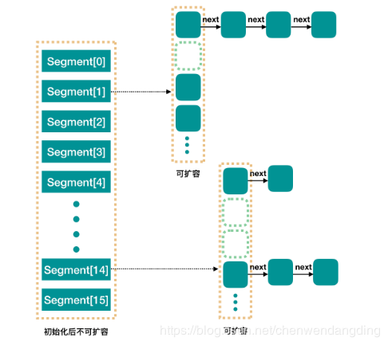
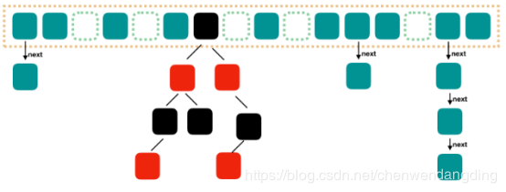

#  ConcurrentHashMap

**jdk1.8之前**




> ConcurrentHashMap结构分为两部分：**segment数组，一旦初始化以后，不可扩容**；segment中的内部数组和链表，**内部数组可扩容**
>
> concurrencyLevel： 并行级别、并发数、Segment 数，默认值是16，也就是说 ConcurrentHashMap 有 16 个 Segments，所以理论上，这个时候，最多可以同时支持 16 个线程并发写，只要它们的操作分别分布在不同的 Segment 上。

**jdk1.8之后**



>JDK1.8之后ConcurrentHashMap结构和JDK1.8之后的HashMap基本上一样，也是保持着数组+链表+红黑树的结构，不同的是，ConcurrentHashMap需要保证线程安全性
>
>数组长度超过8之后，转为红黑树结构   
>
>数据查询复杂的 O(n)，红黑树查询时间复杂度 O(logN)

```java

	/*
     * 
     *  当设置为false的时候表示这个value一定会设置
     *  true的时候，只有当这个key的value为空的时候才会设置
     */
    public V put(K key, V value) {
        return putVal(key, value, false);
    }

/*
     * 当添加一对键值对的时候，首先会去判断保存这些键值对的数组是不是初始化了，
     * 如果没有的话就初始化数组
     *  然后通过计算hash值来确定放在数组的哪个位置
     * 如果这个位置为空则直接添加，如果不为空的话，则取出这个节点来
     * 如果取出来的节点的hash值是MOVED(-1)的话，则表示当前正在对这个数组进行扩容，复制到新的数组，则当前线程也去帮助复制
     * 最后一种情况就是，如果这个节点，不为空，也不在扩容，则通过synchronized来加锁，进行添加操作
     *    然后判断当前取出的节点位置存放的是链表还是树
     *    如果是链表的话，则遍历整个链表，直到取出来的节点的key来个要放的key进行比较，如果key相等，并且key的hash值也相等的话，
     *          则说明是同一个key，则覆盖掉value，否则的话则添加到链表的末尾
     *    如果是树的话，则调用putTreeVal方法把这个元素添加到树中去
     *  最后在添加完成之后，会判断在该节点处共有多少个节点（注意是添加前的个数），如果达到8个以上了的话，
     *  则调用treeifyBin方法来尝试将处的链表转为树，或者扩容数组
     */
    final V putVal(K key, V value, boolean onlyIfAbsent) {
        //K,V都不能为空，否则的话跑出异常
        if (key == null || value == null) throw new NullPointerException();
        //取得key的hash值
        int hash = spread(key.hashCode());    
        //用来计算在这个节点总共有多少个元素，用来控制扩容或者转移为树
        int binCount = 0;    
        for (Node<K,V>[] tab = table;;) {    //
            Node<K,V> f; int n, i, fh;
            if (tab == null || (n = tab.length) == 0)    
                //第一次put的时候table没有初始化，则初始化table
                tab = initTable();    
            //通过哈希计算出一个表中的位置因为n是数组的长度，所以(n-1)&hash肯定不会出现数组越界
            else if ((f = tabAt(tab, i = (n - 1) & hash)) == null) {   
                 //如果这个位置没有元素的话，则通过cas的方式尝试添加，注意这个时候是没有加锁的
                //创建一个Node添加到数组中区，null表示的是下一个节点为空
                if (casTabAt(tab, i, null, new Node<K,V>(hash, key, value, null)))        						// no lock when adding to empty bin
                    break;                   
            }
            /*
             * 如果检测到某个节点的hash值是MOVED，则表示正在进行数组扩张的数据复制阶段，
             * 则当前线程也会参与去复制，通过允许多线程复制的功能，一次来减少数组的复制所带来的性能损失
             */
            else if ((fh = f.hash) == MOVED)    
                tab = helpTransfer(tab, f);
            else {
                /*
                 * 如果在这个位置有元素的话，就采用synchronized的方式加锁，
                 *     如果是链表的话(hash大于0)，就对这个链表的所有元素进行遍历，
                 *         如果找到了key和key的hash值都一样的节点，则把它的值替换到
                 *         如果没找到的话，则添加在链表的最后面
                 *  否则，是树的话，则调用putTreeVal方法添加到树中去
                 *  
                 *  在添加完之后，会对该节点上关联的的数目进行判断，
                 *  如果在8个以上的话，则会调用treeifyBin方法，来尝试转化为树，或者是扩容
                 */
                V oldVal = null;
                synchronized (f) {
                    //再次取出要存储的位置的元素，跟前面取出来的比较
                    if (tabAt(tab, i) == f) {        
                        //取出来的元素的hash值大于0，当转换为树之后，hash值为-2
                        if (fh >= 0) {                
                            binCount = 1;            
                            //遍历这个链表
                            for (Node<K,V> e = f;; ++binCount) {    
                                K ek;
                                //要存的元素的hash，key跟要存储的位置的节点的相同的时候，替换掉该节点的value即可
                                if (e.hash == hash &&        
                                    ((ek = e.key) == key ||
                                     (ek != null && key.equals(ek)))) {
                                    oldVal = e.val;
                                    //当使用putIfAbsent的时候，只有在这个key没有设置值得时候才设置
                                    if (!onlyIfAbsent)        
                                        e.val = value;
                                    break;
                                }
                                Node<K,V> pred = e;
                                //如果不是同样的hash，同样的key的时候，则判断该节点的下一个节点是否为空，
                                if ((e = e.next) == null) {    
                                    //为空的话把这个要加入的节点设置为当前节点的下一个节点
                                    pred.next = new Node<K,V>(hash, key,value, null);
                                    break;
                                }
                            }
                        }
                         //表示已经转化成红黑树类型了
                        else if (f instanceof TreeBin) {   
                            Node<K,V> p;
                            binCount = 2;
                            //调用putTreeVal方法，将该元素添加到树中去
                            if ((p = ((TreeBin<K,V>)f).putTreeVal(hash, key,value)) != null) {
                                oldVal = p.val;
                                if (!onlyIfAbsent)
                                    p.val = value;
                            }
                        }
                    }
                }
                if (binCount != 0) {
                    //当在同一个节点的数目达到8个的时候，则扩张数组或将给节点的数据转为tree
                    if (binCount >= TREEIFY_THRESHOLD)    
                        treeifyBin(tab, i);    
                    if (oldVal != null)
                        return oldVal;
                    break;
                }
            }
        }
        addCount(1L, binCount);    //计数
        return null;
    }
```

>**扩容**
>
>putVal时
>
>1. 首先是根据key的hashCode做一次重哈希（进一步减少哈希碰撞）
>
>2. 先判断table为空，则初始化Map，否则：
>
>3. 根据hashCode取模定位到table中的某个节点f，如果f为空，则新创建一个节点，使用cas方式更新到数组的f节点上，插入结束，否则：
>
>4. 若f是转移转移节点，说明Map正在扩容，则调用helpTransfer协助转移，否则：
>
>5. 锁定节点f（通过synchronized加锁）
>
>6. 节点f锁定成功后判断节点f类型，如果f是链表节点，则直接插入到链表底端（key不存在的话），如果节点f是红黑树节点，则按照二叉搜索树的方式插入节点，并调整树结构使其满足红黑规则
>
>7. 最后调用addCount更新Map中的节点计数
>
>**helpTransfer**主要用于通过计算来验证Map是否需要协助扩容，如果Map正在扩容且扩容未结束则协助扩容，并通过transfer执行扩容过程
>
>**transfer**方法为实际的扩容实现，实现过程有些复杂，
>
>1. 第一个扩容线程进来后创建nextTable数组，并设置transferIndex；
>
>2. 线程（第一个或其他）通过transferIndex-stride（扩容步长）来领取一个扩容子任务，transferIndex减到0说明所有子任务领取完成；
>
>3. 线程领取到扩容子任务后设置当前处理子任务的下界并更新当前处理节点所在的索引位置；
>
>4. 对子任务中的每个节点，扩容线程**从后向前**依次判断该节点是否已经转移，如果没有转移，则对该节点进行加锁，并且把节点对应的链表或红黑树转移到新数组nextTable中去；
>
>5. 如果线程处理的节点索引已经到达子任务的下界，则子任务执行结束，并尝试去领取新的子任务，若领取不到再判断当前线程是否是最后一个扩容线程，若是则最后扫描一遍数组，执行清理工作，否则直接退出。

```java
/**
     * Moves and/or copies the nodes in each bin to new table. See
     * above for explanation.
     */
    private final void transfer(Node<K,V>[] tab, Node<K,V>[] nextTab) {
        int n = tab.length, stride;
        //根据table的长度及cpu核数计算转移任务步长
        if ((stride = (NCPU > 1) ? (n >>> 3) / NCPU : n) < MIN_TRANSFER_STRIDE) // 计算转移步长并判断是否小于最小转移步长
            stride = MIN_TRANSFER_STRIDE; // subdivide range
        if (nextTab == null) {            // 第一个扩容线程进来需要初始化nextTable
            try {
                @SuppressWarnings("unchecked")
                Node<K,V>[] nt = (Node<K,V>[])new Node<?,?>[n << 1];
                nextTab = nt;
            } catch (Throwable ex) {      // try to cope with OOME
                sizeCtl = Integer.MAX_VALUE;
                return;
            }
            nextTable = nextTab;
            transferIndex = n;
        }
        int nextn = nextTab.length;
        ForwardingNode<K,V> fwd = new ForwardingNode<K,V>(nextTab);
        boolean advance = true; 
        boolean finishing = false; // to ensure sweep before committing nextTab
        for (int i = 0, bound = 0;;) {
            Node<K,V> f; int fh;
            while (advance) {
                int nextIndex, nextBound;
                if (--i >= bound || finishing) //当前索引已经走到了本次扩容子任务的下界，子任务转移结束
                    advance = false;
                else if ((nextIndex = transferIndex) <= 0) {//任务转移完成
                    i = -1;
                    advance = false;
                }
               //通过cas方式尝试获取一个转移任务（transferIndex - 转移步长stride），获取成功后得到处理的下界及当前索引
                else if (U.compareAndSwapInt
                         (this, TRANSFERINDEX, nextIndex,
                          nextBound = (nextIndex > stride ?
                                       nextIndex - stride : 0))) {
                    bound = nextBound;  // 更新当前子任务的下界
                    i = nextIndex - 1;  // 更新当前index位置  
                    advance = false;
                }
            }
            if (i < 0 || i >= n || i + n >= nextn) { // 扩容结束
                int sc;
                if (finishing) {             // 最后一个出去的线程：更新table指针及sizeCtl值
                    nextTable = null;
                    table = nextTab;     // 指向扩容后的数组
                    sizeCtl = (n << 1) - (n >>> 1);  //sizeCtl更新为最新的扩容阈值（2n - 0.5n = 1.5n =  2n * 0.75），移位实现保证高效率
                    return;
                }
                // sizeCtl减1，表示减少一个扩容线程
                if (U.compareAndSwapInt(this, SIZECTL, sc = sizeCtl, sc - 1)) {
                    // 判断是否是最后一个扩容线程，如果不是则直接退出，由于第一个线程进来时把扩容戳rs左移16位+2更新到sizeCtl，所以如果是最后一个线程的话，sizeCtl -2 应该等于rs左移16位
                    if ((sc - 2) != resizeStamp(n) << RESIZE_STAMP_SHIFT)
                        return;
                    finishing = advance = true;//如果是最后一个线程，则结束标志更新为真，并且在重新检查一遍数组
                    i = n; // recheck before commit
                }
            }
            else if ((f = tabAt(tab, i)) == null)    // 当前桶节点为空，设置为转移成转移节点
                advance = casTabAt(tab, i, null, fwd);
            else if ((fh = f.hash) == MOVED)   // 该桶节点已经被转移
                advance = true; // already processed
            else {
                synchronized (f) {         // 获取该节点的锁
                    if (tabAt(tab, i) == f) {// 获取锁之后再次验证是否被其他线程修改过
                        Node<K,V> ln, hn;
                        if (fh >= 0) {        // 节点HasCode大于0 代表该节点为链表节点
                            // 由于数组长度n为2的幂次方，所以当数组长度增加到2n时，原来hash到table中i的数据节点在长度为2n的table中要么在低位nextTab[i]处，要么在高位nextTab[n+i]处，具体在哪个位置与(fh & n)的计算结果有关
                            int runBit = fh & n;
                            Node<K,V> lastRun = f;
                            // 此处循环的目的是找到链表中最后一个从低索引位置变到高索引位置或者从高索引位置变到低索引位置的节点lastRun，从lastRun节点到链表的尾节点可根据runBit直接插入到新数组nextTable的节点中，其目的是尽量减少新创建节点数量，直接更新指针位置
                            for (Node<K,V> p = f.next; p != null; p = p.next) {
                                int b = p.hash & n;
                                if (b != runBit) {
                                    runBit = b;
                                    lastRun = p;
                                }
                            }
                            if (runBit == 0) {
                                ln = lastRun;
                                hn = null;
                            }
                            else {
                                hn = lastRun;
                                ln = null;
                            }
                           // 对于lastRun之前的链表节点，根据hashCode&n可确定即将转移到nextTable中的低索引位置节点（nextTab[i]）还是高索引位置节点（nextTab[i + n]），并形成两个新的链表
                            for (Node<K,V> p = f; p != lastRun; p = p.next) {
                                int ph = p.hash; K pk = p.key; V pv = p.val;
                                if ((ph & n) == 0)
                                    ln = new Node<K,V>(ph, pk, pv, ln);
                                else
                                    hn = new Node<K,V>(ph, pk, pv, hn);
                            }
                            // 使用cas方式更新两个链表到新数组nextTable中，并且把原来的table节点i中的数值变为转移节点
                            setTabAt(nextTab, i, ln);
                            setTabAt(nextTab, i + n, hn);
                            setTabAt(tab, i, fwd);
                            advance = true;
                        }
                        else if (f instanceof TreeBin) {   //该节点为二叉搜索数节点（红黑树）
                            TreeBin<K,V> t = (TreeBin<K,V>)f;
                            TreeNode<K,V> lo = null, loTail = null;
                            TreeNode<K,V> hi = null, hiTail = null;
                            int lc = 0, hc = 0;
                            for (Node<K,V> e = t.first; e != null; e = e.next) {
                                int h = e.hash;
                                TreeNode<K,V> p = new TreeNode<K,V>
                                    (h, e.key, e.val, null, null);
                                if ((h & n) == 0) {
                                    if ((p.prev = loTail) == null)
                                        lo = p;
                                    else
                                        loTail.next = p;
                                    loTail = p;
                                    ++lc;
                                }
                                else {
                                    if ((p.prev = hiTail) == null)
                                        hi = p;
                                    else
                                        hiTail.next = p;
                                    hiTail = p;
                                    ++hc;
                                }
                            }
                            ln = (lc <= UNTREEIFY_THRESHOLD) ? untreeify(lo) :
                                (hc != 0) ? new TreeBin<K,V>(lo) : t;
                            hn = (hc <= UNTREEIFY_THRESHOLD) ? untreeify(hi) :
                                (lc != 0) ? new TreeBin<K,V>(hi) : t;
                            setTabAt(nextTab, i, ln);
                            setTabAt(nextTab, i + n, hn);
                            setTabAt(tab, i, fwd);
                            advance = true;
                        }
                    }
                }
            }
        }
    }
```

