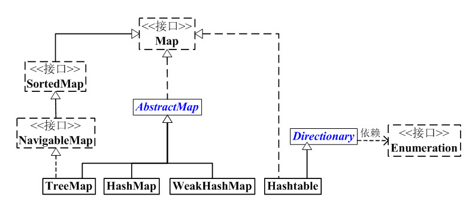

# Map

(01) Map 是“键值对”映射的抽象接口。

(02) AbstractMap 实现了Map中的绝大部分函数接口。

(03) SortedMap 有序的“键值对”映射接口。

(04) NavigableMap 是继承于SortedMap的，支持导航函数的接口。

(05) HashMap, Hashtable, TreeMap, WeakHashMap 都是“键值对”映射的实现类。

　　HashMap基于“拉链法”实现的散列表。非线程安全。

　　Hashtable基于“拉链法”实现的散列表。线程安全。

　　WeakHashMap 基于“拉链法”实现的散列表，非线程安全。相比HashMap，WeakHashMap中的键是“弱键”，当“弱键”被GC回收时，它对应的键值对也会被从WeakHashMap中删除；而HashMap中的键是强键。

　　TreeMap有序的散列表，它是通过红黑树实现的。一般用于存储有序的映射。非线程安全

## HashMap和Hashtable异同

### 相同点：

1. 都是“键值对(key-value)”的散列表，都采用拉链法实现。

存储思想：通过table数组存储，数组的每一个元素都是一个Entry；而一个Entry就是一个单向链表，Entry链表中的每一个节点就保存了key-value键值对数据

### 不同点：

1. HashMap继承于AbstractMap，而Hashtable继承于Dictionary，Dictionary是一个抽象类，它直接继承于Object类，没有实现任何接口，API函数比Map少。

2. Hashtable 线程安全; HashMap 线程非安全

3. HashMap的key、value都可以为null。

   Hashtable的key、value都不可以为null

4. 扩容机制

   加载因子/初始容量/ 扩容大小

   HashMap  0.75 / 16  / 容量x2

   Hashtable  0.75 /11 /  容量x2 + 1

5. hash值算法不同

   HashMap: 自定义的哈希算法。

   Hashtable没有自定义哈希算法，而直接采用的key的hashCode()

## HashMap和WeakHashMap异同

### 相同点：

1. 都是散列表，存储的是“键值对”映射。

2. 继承于AbstractMap，并且实现Map基础。

3. 构造函数都一样。

4. 默认的容量大小是16，默认的加载因子是0.75。

5. “键”和“值”都允许为null。

6. 线程非安全。

### 不同点：

​		**HashMap的“键”是“强引用(StrongReference)”**，而**WeakHashMap的键是“弱引用(WeakReference)”**