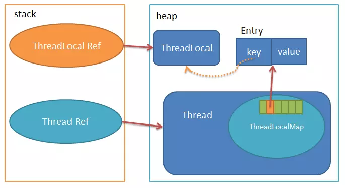

```
储存：ThreadLocal.ThreadLocalMap 对象
key：ThreadLocal对象本身
value: 需要储存的值
```


# 1. 对象结构：

```java
public class ThreadLocal{
    public void set(T value) {
       //获取当前线程
       Thread t = Thread.currentThread();
       //获取线程中的map对象
       ThreadLocalMap map = getMap(t);
       if (map != null)
        	// key为当前ThreadLocal对象
            map.set(this, value);
        else
        	// map初始化
            createMap(t, value);
    }
    
    // Thread 中的ThreadLocalMap
    ThreadLocalMap getMap(Thread t) {
        return t.threadLocals;
    }

    public T get() { 
        Thread t = Thread.currentThread(); 
        // 获取Thread中的ThreadLocalMap
        ThreadLocalMap map = getMap(t); 
        if (map != null) { 
        	// 以当前ThreadLocal为键，获取Entry对象，并从Enrty中取出值
            ThreadLocalMap.Entry e = map.getEntry(this);
            if (e != null) { 
                @SuppressWarnings("unchecked") 
                T result = (T)e.value; 
                return result; 
            } 
		}
    // 返回threadLocalMap初始化值
     return setInitialValue(); 
	}

    private T setInitialValue() { 
         //初始化value值，这个方法初始化值是null
        T value = initialValue(); 
        Thread t = Thread.currentThread(); 
        ThreadLocalMap map = getMap(t); 
        if (map != null) 
        	map.set(this, value); 
        else 
        	createMap(t, value); 
        return value; 
    }
    static class ThreadLocalMap {
    	// **Entry用的是弱引用，key可能会被GC掉**
    	static class Entry extends WeakReference<ThreadLocal<?>> {
       	 	/** The value associated with this ThreadLocal. */
       		Object value;
       		Entry(ThreadLocal<?> k, Object v) {
            	super(k);
            	value = v;
       		 }
    	}
    private Entry getEntry(ThreadLocal<?> key) { 
        //计算索引位置i
        int i = key.threadLocalHashCode & (table.length - 1); 
        Entry e = table[i]; 
        //如果Entry存在且Entry的key恰巧等于ThreadLocal，那么直接返回Entry对象
        if (e != null && e.get() == key) 
      	  return e; 
        else 
       	 return getEntryAfterMiss(key, i, e);
     }

    private Entry getEntryAfterMiss(ThreadLocal<?> key, int i, Entry e) { 
        Entry[] tab = table; 
        int len = tab.length; 
        // **为什么循环查找？,**ThreadLocal采用的是开放地址法，即有冲突后，把要插入的元素放在要插入的位置后面为null的地方
        while (e != null) { 
       	 	ThreadLocal<?> k = e.get(); 
            if (k == key) 
            	//如果k==key,那么代表找到了这个所需要的Entry
           	 	return e; 
       		if (k == null) 
        		//k==null，那么证明这个Entry中key已经为null,那么这个Entry就是一个过期对象，这里调用expungeStaleEntry清理该Entry。之前提到的可能导致内存泄漏，实际上，每次调get，set操作时都会不断清理掉key=null的Enty
        		expungeStaleEntry(i); 
        	else 
        		i = nextIndex(i, len); 
        	e = tab[i]; 
        }
         return null; 
    	}

    private void set(ThreadLocal<?> key, Object value) { 
    	Entry[] tab = table; 
    	int len = tab.length;
    	int i = key.threadLocalHashCode & (len-1); 
    	//根据key计算出位置i，然后查找i位置上的Entry
    	//不断循环检测，直到遇到为null的地方
    	for (Entry e = tab[i]; e != null; e = tab[i = nextIndex(i, len)]) { 
            ThreadLocal<?> k = e.get();
             if (k == key) {
            	//若是Entry已经存在并且key等于传入的key，那么这时候直接给这个Entry赋新的value值
             	e.value = value; 
             	return; 
            } 
            if (k == null) { 
            	//若是Entry存在，但是key为null，则调用replaceStaleEntry来更换这个key为空的Entry， **replaceStaleEntry中的替换逻辑不是很理解，后续有时间可以再补充一下**
            	replaceStaleEntry(key, value, i); 
            	return; 
            } 
         } 
    	// 没有发现null的位置，新建一个节点插入
    	tab[i] = new Entry(key, value);
     	int sz = ++size;
     	if (!cleanSomeSlots(i, sz) && sz >= threshold)
     		rehash();
     	}
    }
}

public class Thread{
    //线程中的ThreadLocalMap对象  map对象
	ThreadLocal.ThreadLocalMap threadLocals = null;
}
```

# ThreadLocalMap.Entry扩容

初始容量：16

threshold初始值： len * 2 / 3

扩容 ：  当前容量*2

# 总结

1. ThreadLocal的作用是提供线程内的局部变量，在各线程内部创建一个变量的副本，相比于使用各种锁机制访问变量，ThreadLocal的思想就是用空间换时间，使各线程都能访问属于自己这一份的变量副本，变量值不互相干扰，减少同一个线程内的多个函数或者组件之间一些公共变量传递的复杂度。

2. ThreadL中的ThreadLocalMap对象中，用于储存k-v的对象Entry，key是弱引用。当ThreadLocal Ref销毁时，指向堆ThreadLocal实例的唯一一条强引用消失了，此时ThreadLocal实例可能被GC，则Entry实例中的key为null了，但是Value值还在，无法被回收，所以可能导致内存泄漏。

3. 使用ThreadLocal时，需要手动调用remove函数，删除不再使用的ThreadLocal，防止内存泄漏.

4. 尽量将ThreadLocal设置成**private static**的，这样ThreadLocal会尽量和线程本身一起消亡.

