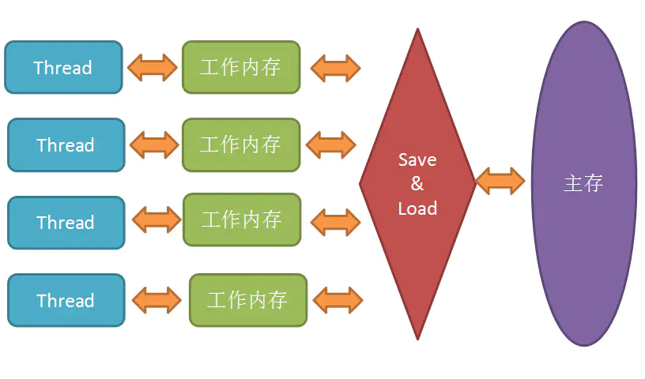

**被volatile修饰的共享变量，有两个特性**

1. 保证了不同线程对该变量操作的内存可见性

2. 禁止指令重排

-----

Java虚拟机定义了一种规范：Java内存模型（JMM），用于屏蔽掉各种硬件和操作系统的内存访问差异，让java程序能在各种平台都能达到一致的内存访问效果。

在Java内存模型中，所有的变量都是存在主存中的。每个线程都包含自己的工作内存，所有的线程都只能访问自己的工作内存，在工作前后把值同步回主内存。



使用主存和工作内存，虽然速度上快了，但是同时导致了读写不一致的问题。

通过 原子性，可见性，有序性来解决这个问题。

**1. 原子性：**

​	一个操作，要么全部做完，要么全部没做执行。

```java
j = 2；
j = i ;
i++;
```

上诉操作中，第一个只有读取操作，一定是原子性操作。第二步操作，分为，1 读取i的值，2 赋值给j，两步操作，不是原子性操作。

**2. 可见性:**

​		一个线程修改某个变量时，会立刻刷新到主存中，并使其他线程中的这个变量的副本失效，其他线程再去读这个变量时，会从主存中读取新值。synchronized和Lock也可以保证可见性，但是开销很大。	

**3. 有序性：**

​		JMM允许编译器和处理器对指令进行重排，但是规定了 as-id-serial语义，即不管怎么排序，最终的执行结果不能改变。但是这只保证了单线程的执行，不能保证多线程的执行结果。

---

另外，JMM 具备一些先天的有序性，即不需要任何手段就可以保证的有序性，称为 **happens-before原则**。

volatile 关键字可以保证可见性，和有序性。

**当写一个volatile变量时，JMM会把该线程对应的本地内存中的共享变量刷新到主内存**

**当读一个volatile变量时，JMM会把该线程对应的本地内存置为无效，线程接下来将从主内存中读取共享变量。**

但是保证不了原子性。要保证原子性，只能借助于synchronized,Lock以及并发包下的atomic的原子操作类。

**volatile底层的实现机制**

​		volatile关键字修饰的变量，在编译成汇编后，都会有一个 lock 指令修饰。

​		lock指令可以保证一个cpu核心在操作期间独占一片内存区域。

用到volite的地方：

1. 变量修饰，volatile bool flag = false;

2. 双重检测锁定的单例模式的实现