#  OCR技术详解

> OCR（Optical Character Recognition，光学字符识别）
>
> OCR技术实现的关键目标在于，**检测出待识别文本的位置**并且**分割成单个文本**；随后进行**模板匹配**，推测出待识别项是属于哪一个分类，即是什么字符；最后可以做**先验知识校验及结果矫正**以提高最后的识别准确率

-----

### 以下，以一张验证码图片识别为例，来大致介绍OCR的整个过程

需要识别的图片

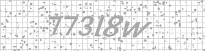

1. 输入图像

   > 基于opencv，读取图片

2. 图像预处理（图像缩放，裁剪，旋转；边缘检测；倾斜矫正；特征提取；图像去噪）

   > **目的:** 在图片正式检测识别前，尽可能高的提升图片的质量。
   >
   > 自然场景下，例如身份证，签证，护照等证件的识别，需要用户拍照上传。用户拍照会有角度偏差，光线影响等，则需要做预处理操作。这个过程非常重要，直接影响后续的操作，好的预处理操作，能让后面的步骤变得更简单，最终的识别结果也会更加准确。
   >
   > 可以使用几个方法来提升输入图像的质量：1 前端页面引导用户摆正拍摄 。2 用户上传图片后，根据图像特征，检测图片角度，进行旋转，矫正等操作。3 对有阴影或者曝光的图像，使用自适应二值化，腐蚀，膨胀等操作校验，若阴影或者曝光较大，无法处理，可以做拒识处理，引导用户重新拍摄上传。
   >
   > 这里的验证码这个简单场景，特征单一，不需要这一步，不详细介绍不同的算法处理过程了。

3. 文本检测与字符分割

   > **目的:**将图像中的待识别文本，单个字符切割开来
   >
   > 传统方法：特征工程，基于opencv的图像特征处理
   >
   > 深度学习：CTPN神经网络文本检测，在深度学习检测的基础上做再次检测
   >
   > **说明**: 文本的检测与分割是OCR技术的主要难点所在，尤其面对复杂的自然场景，用户拍出来的照片会各种各样，主要的问题有，1 角度旋转，包括平面旋转，仿射旋转 2 过度曝光和阴影，这个需要借助opencv的自适应二值化算法，或者深度学习算法解决 3 意想不到的噪声， 这个根据特征工程去除

   >验证码特征很单一，用特征工程即可。
   >
   >1. 对图像**二值化**处理，以及去除影响最大的网格噪声
   >
   >  读取图片，对所有像素聚合，可以发现，网格像素值与字体像素值有明显差异，网格背景的像素值为211 , 字体像素值170 (直接使用windows自带的画图工具，也可以看到像素值的差异) 。 这里可以使用**全局二值化**直接将网格噪声去除，二值化阈值取 190，  像素值小于 190 的置为0，像素值大于190的置为255
   >
   >  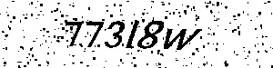
   >
   >2. 使用**连通域分析**，去除椒盐噪声
   >
   >  连通域： 指图像中具有相同像素值且位置相邻的前景像素点组成的图像区域
   >
   >  这里使用到的连通域分析算法：[连通域算法](./常用算法/连通域算法.md)
   >
   >  取最大的6个连通域，即是我们要找的6个字符的位置，取连通域的外接矩形，画出来如下
   >
   >  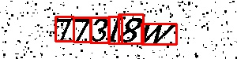
   >
   >  （在这个场景下，有少部分字符会连在一起，需要用像素按X轴投影累加值计算，做字符的分割，字符连接处的像素值往往有很大的突变。）
   >
   >3. 按矩形位置，切割出待识别的字符
   >
   >  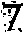	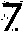	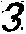	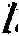	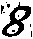	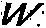
   >
   >4. 去除剩余噪声
   >
   >  截取出来的图片，还有很多小的噪声，使用第二个步骤中的连通域分析，保留最大的连通域，将较小的连通域的像素值全部置为0 
   >
   >  		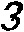	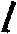	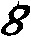	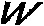
   >
   >5. 统一缩放
   >
   >  不同场景下的图片大小不一，在下一步的字符匹配中，需要统一字符的大小，进行字符匹配。这里缩放成40*40的大小
   >
   >  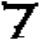	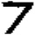	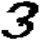	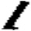		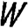
   >
   >  

4. 字符匹配

   > **目的:**将切割好的字符文本与事先准备的模板进行匹配 （某些场景下也可以是多个字符一起匹配）
   >
   > 传统方法：模板匹配
   >
   > 深度学习：cnn网络识别

   > 以上两种识别方法，都需要准备大量的学习模板，模板的量取决于最终想要的准确率。
   >
   > 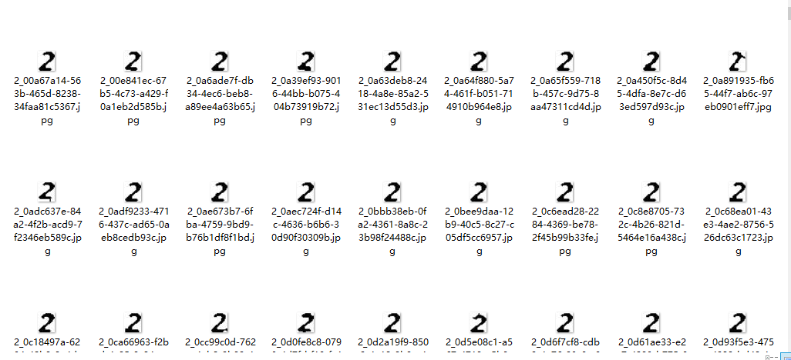
   >
   > 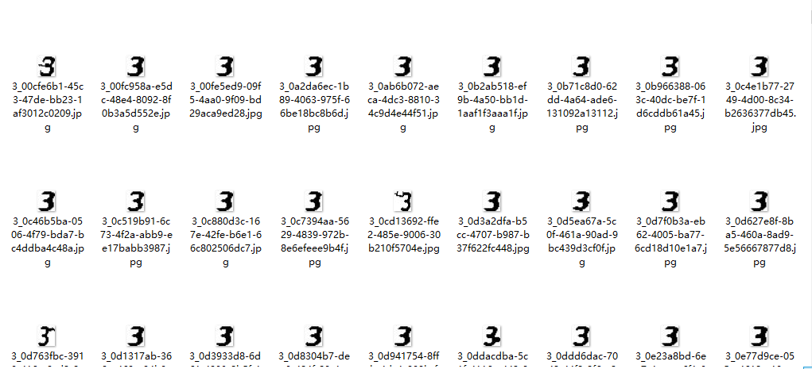

   > 以数字  **8**  为例，上面的模板处理后，压缩储存成以下形式
   >
   > 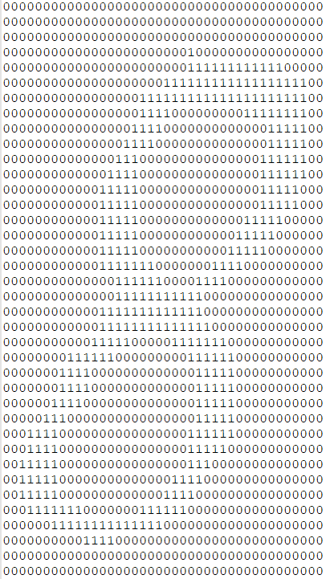

   > 传统方法与深度学习识别方法差异：
   >
   > 传统方法：将待识别字符的二维数组与所有模板的的二维数组，做**异或**运算
   >
   > ​					运算规则：0⊕0=0，1⊕0=1，0⊕1=1，1⊕1=0；
   >
   > ​					所有像素点的运算值，计算总和，运算值总和越小，则说明待识别字符与模板的相似度越高，相似度最高的那一项即是字符匹配的值。
   >
   > 深度学习：基于神经网络的的字符分类。
   >
   > 推荐一个简单的分类demo，实际上这个简单的demo也足够hold住这个分类场景
   >
   > https://github.com/hujunxianligong/Tensorflow-CNN-Tutorial
   >
   > 深度学习的几个基本概念
   >
   > https://zhuanlan.zhihu.com/p/32714733

5. 后处理

   > 相似度分析，先验知识校验

   > 后处理的目的，是为了在模板匹配后，根据先验知识，对匹配结果进行校正，提高最后的识别准确率。
   >
   > 对于不同的场景，有不同的后处理方式。比如说，对于身份证识别中的 *身份证号* 模板匹配中，*身份证号*是有一定规律的，只会存在数字或者X字母；在不同的籍贯下，数字也有一定的规律；在者，有些公司有大量的实名数据，可以将识别结果与识别数据对照，进行识别结果的校验，矫正匹配错误的结果。

6. 结果输出

## 常见问题

> 以上的识别过程是一个标准化的OCR流程，上面的例子的处理过程是假设不会存在**一些意外的情况下**操作的。
>
> 在自然场景下，用户拍出来的一定会有意想不到的情况。而这些意想不到的情况，则是OCR真正的**难点**所在，这需要更多的**图形学操作**，来处理自然场景下图片。目标：以图形学操作，寻找**真实特征**，排除干扰噪声（一切不是目标识别项的位置皆是噪声）
>
> 比如以**签证识别**为例
>
> 1. 硬变形 (图片弯曲，导致字体变形)
>
>    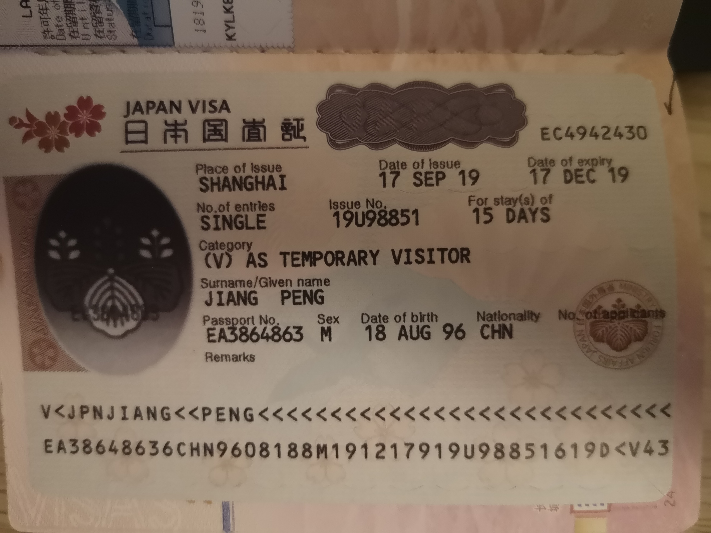
>
> 2. 阴影，光线差异大（导致二值化处理困难，可能会大面积“变黑”）
>
> 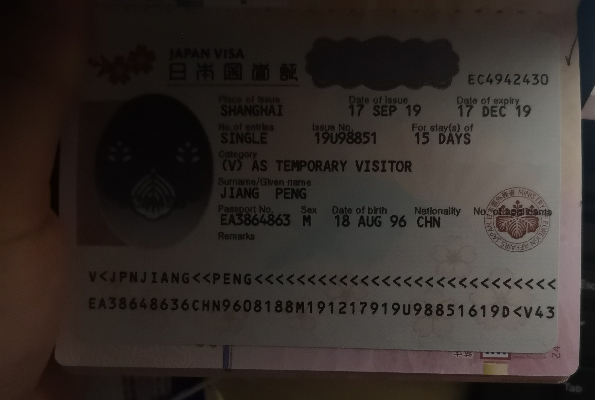
>
> 3. 遮挡 （导致某些待识别项无法识别）
>
> 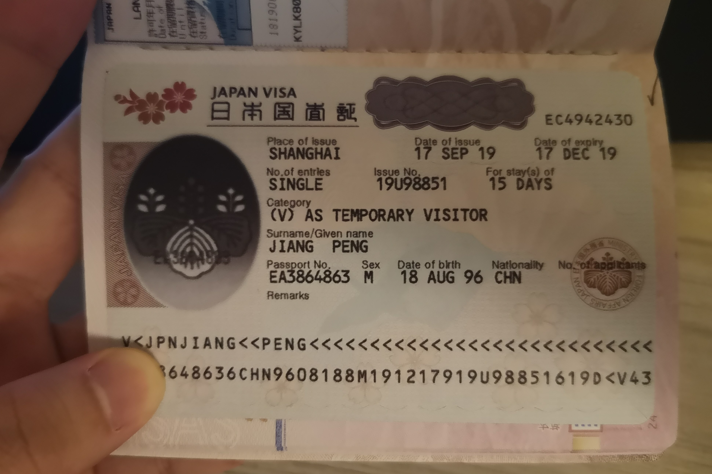
>
> 还有几种场景的场景，比如 **软变形**（图片扭曲，折痕），**曝光**（图片有明显的曝光点），这里不一一列举了。

## 总结

OCR无法使用工程上的**因果**关系去介绍，自然场景下的*意外* ，使所有的操作变的**不必然**，更多的在于**实践**，不断的优化处理算法，以尽可能的提高识别准确率。

