#  OCR技术介绍

### 二值化

二值化可以把灰度图像转换成二值图像。 把大于某个临界灰度值的像素灰度设为灰度極大值，把小于这个值的像素灰度设为灰度极小值

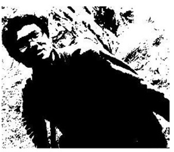

其他：全局二值化otsu ，自适应二值化： 局部均值二值化sauvola， 局部中值二值化adaptive

算法比较

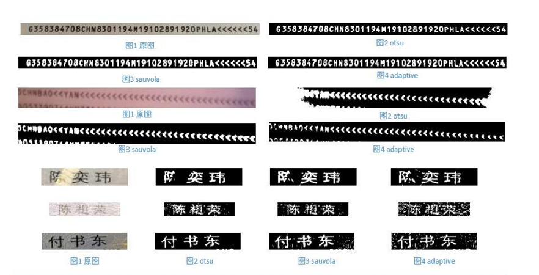

##  腐蚀与膨胀

形态学操作其实就是**改变物体的形状**，一般作用于二值化图，来连接相邻的元素或分离成独立的元素。

腐蚀：局部最小值

原理：在原图的小区域内取局部最小值。因为是二值化图，只有0和255，所以小区域内有一个是0该像素点就为0

1. 定义一个卷积核B。核可以是任何的形状和大小，它拥有一个单独定义出来的参考点，我们称其为锚点（anchorpoint）。多数情况下，核是一个小的中间带有参考点和实心正方形或者圆盘，其实，我们可以把核视为模板或者掩码。

2. 将核B与图形A进行卷积，计算核B覆盖区域的像素点的最小值

3. 将这个最小值赋值给参考点指定的像素，因此，图像中的高亮区域逐渐减小

   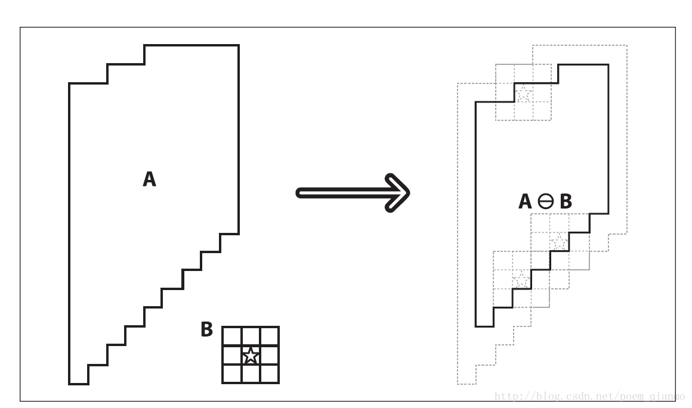

膨胀: 局部最大值（与腐蚀相反）

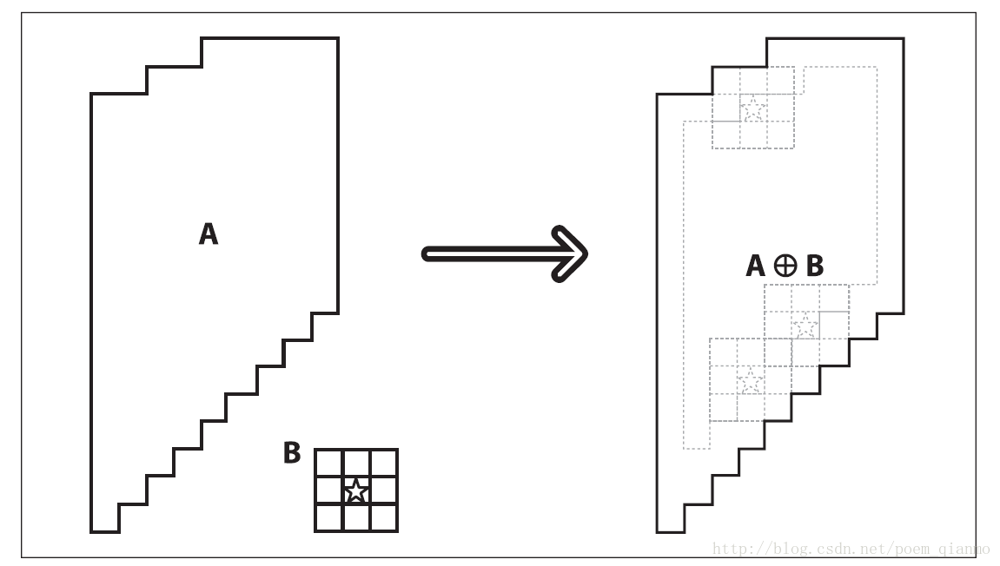

**腐蚀与膨胀**

原图

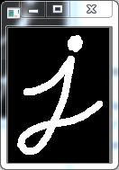

腐蚀：1.  边界附近的所有像素都将被丢弃，具体取决于内核的大小。

2. 有助于消除小的白噪声，分离两个连接的对象

   

膨胀: **连接对象的破碎部分**.

开运算: 先腐蚀再膨胀，有助于消除噪音

	

闭运算:  先膨胀后腐蚀，用于消除前景对象内的小孔或对象上的小噪声（小黑点）

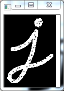	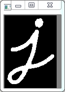

## 滤波

尽量保留图像细节特征的条件下对目标图像的噪声进行抑制，是图像预处理中不可缺少的操作，其处理效果的好坏将直接影响到后续图像处理和分析的有效性和可靠性

**目的**

1. 消除图像中混入的噪声
2. 为图像识别抽取出图像特征

**均值滤波**

1. 定义一个卷积核B。核可以是任何的形状和大小，它拥有一个单独定义出来的参考点，我们称其为锚点（anchorpoint）。多数情况下，核是一个小的中间带有参考点和实心正方形或者圆盘，其实，我们可以把核视为模板或者掩码。

2. 将卷积核中的所有像素的**均值**，替换锚点的像素值

**中值滤波**

将卷积核中的所有像素的**中值**，替换锚点的像素值

**高斯滤波**

高斯滤波，其能够很好的消除噪声。高斯滤波过程中，每个像素点都是由本身和邻域内的其他像素值经过加权平均后得到的。

从数学的角度来看，图像的高斯模糊过程就是图像与正态分布做卷积，由于正态分布也被称为高斯分布，因此这项技术被称为高斯模糊。

由于高斯函数的傅里叶变换是另外一个高斯函数，所以高斯模糊对图像来说就是一个低通滤波器。

N维空间正态分布方程和二维空间正态分布分别为：

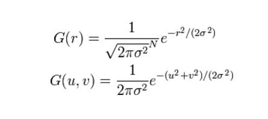

--------

### 常见且复杂的 场景

**硬变形**

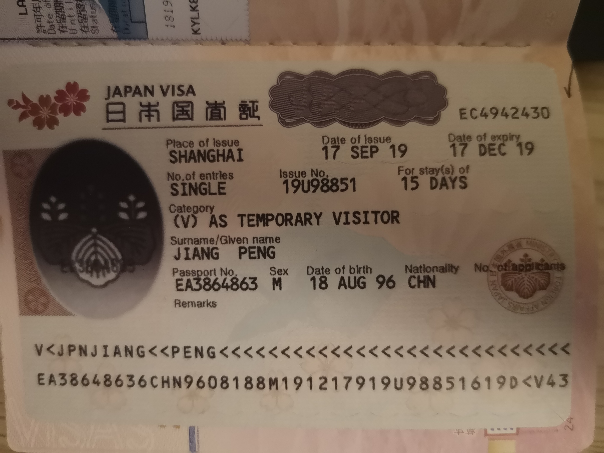

**软变形**

**曝光**

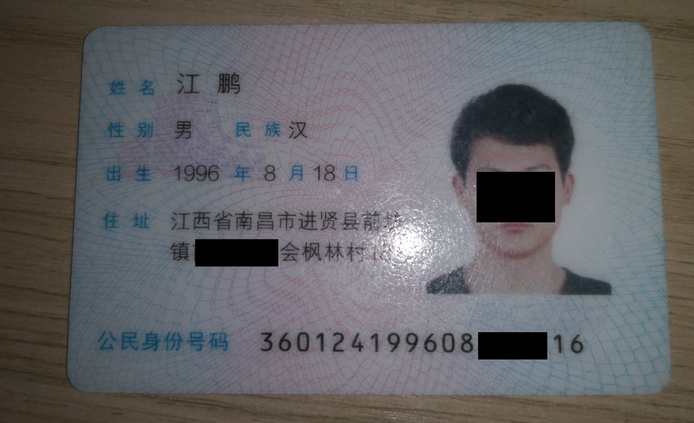

**阴影**

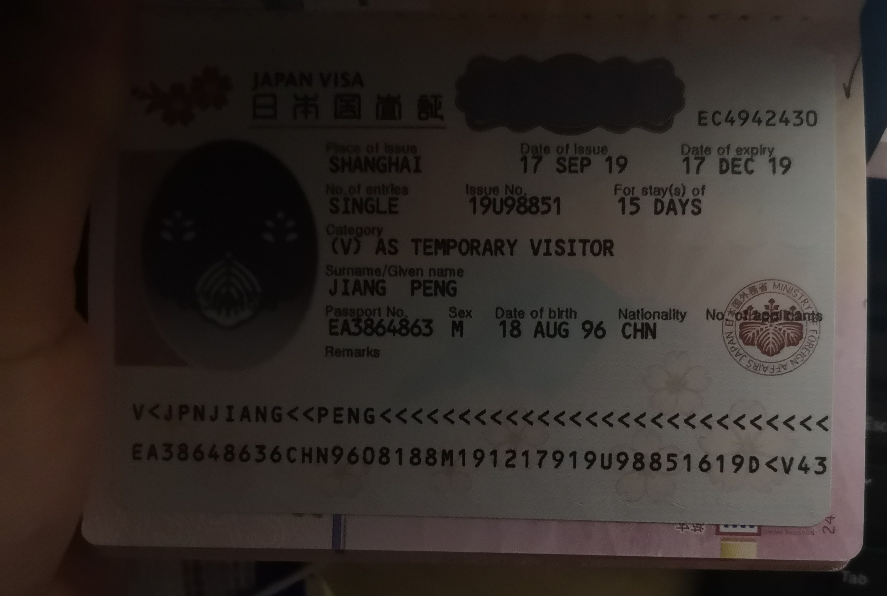

**遮挡**

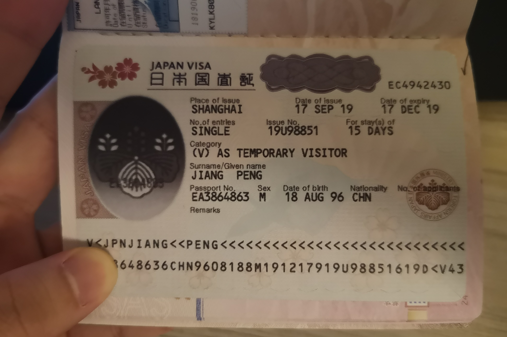

##  灰度投影

1. 计算在**水平**和**垂直**方向的灰度值投影。(可理解为记录每行、列的灰度平均
     值的数组,不同mode算法不同)
2. 将灰度投影所得到的每行(列)灰度值,作为点的x (y)坐标,生成一组点区域。从
     而将灰度投影获得的结果可视化,后续可直接对生成的区域进行处理
3. 由于待检测的行(列)存在**灰度跳变**,因此,可以根据求得的灰度投影值将行列分离

**什么是跳变**

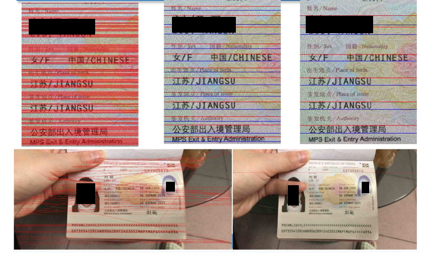

## Hog直线检测

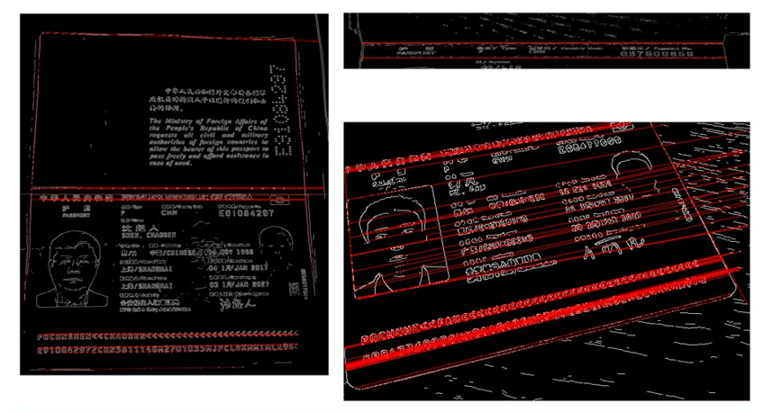

## OCR处理的一般步骤

1. 预处理
2. 检测 
3. 识别 （模板匹配）
4. 后处理

------

# 深度学习

前面是一些**可解释性**的技术，下面介绍一些**不可解释**的

深度学习：数据驱动

-----

1. 加权求和的 非线性激活函数

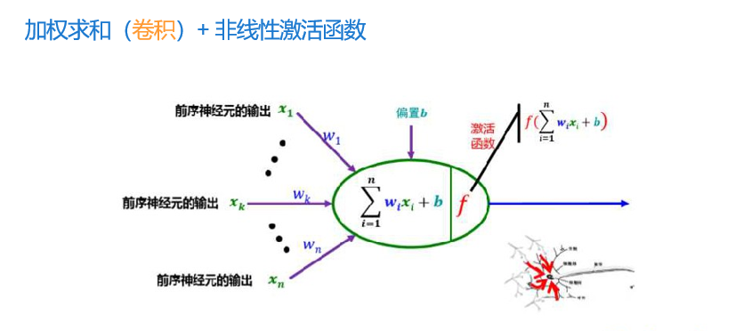

2. 层级感受野

   一个神经细胞看得更远（视野更大），能处理更复杂的任务，是因为他站在了其他神经元的肩膀上。

   可以类比：社会结构，公司高层能做出更加符合公司发展的战略计划

   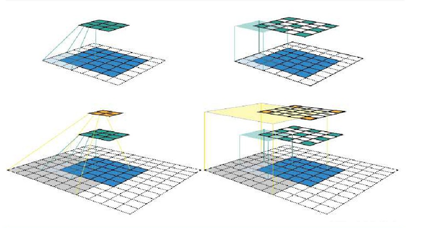

3. 卷积神经网络

   卷积神经网络（Convolutional Neural Network）是一种专门用来处理具有类似网格结构的数据的神经网络，特别是图像数据（二维矩阵数据）。

   这是一种 模拟**层级感受野**的前馈神经网络

   若干卷积层（非线性激活后），交叉若干Pooling（下采样）层

   若干全连接层（特征加权），最后一层输出为类别标签（或目标回归值）

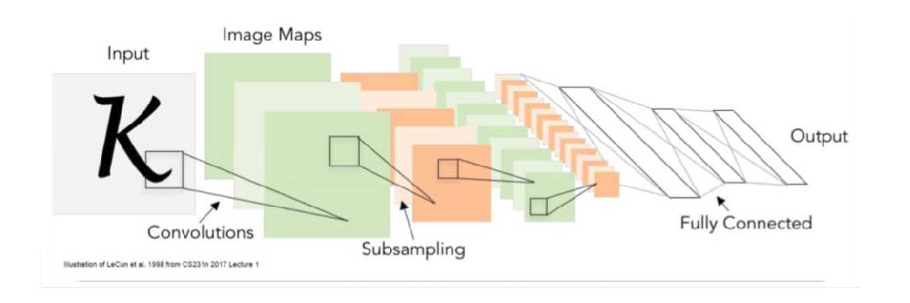

​	卷积操作：图像和核（权重）的加权求和
​	作用：滤波器，或者称**局部特征提取**
 	算法本质：张量卷积=矩阵的乘法

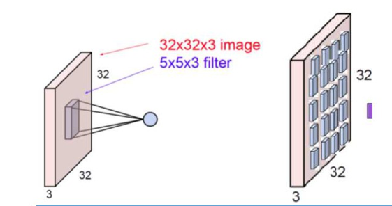

**卷积层**： 局部连接、加权求和
作用：特征提取器，越来越复杂的特征，**逐层抽象**

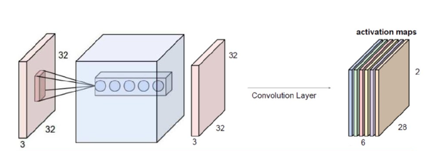

## CTPN

检测一个一个小的，固定宽度的文本段，然后再后处理部分再将这些小的文本段连接起来，得到文本行。具体的说，作者的基本想法就是去预测文本的竖直方向上的位置，水平方向的位置不预测。因此作者提出了一个vertical anchor的方法。与faster rcnn中的 anchor类似，但是不同的是，vertical anchor的宽度都是固定好的了，论文中的大小是16个像素。而高度则从11像素到273像素变化，总共10个anchor。

整个算法的流程主要有以下几个步骤

1. 首先，使用VGG16作为base net提取特征，得到conv5_3的特征作为feature map，大小是W×H×C
2. 然后在这个feature map上做滑窗，窗口大小是3×3。也就是每个窗口都能得到一个长度为3×3×C的特征向量。这个特征向量将用来预测和10个anchor之间的偏移距离，也就是说每一个窗口中心都会预测出10个text propsoal。
3. 将上一步得到的特征输入到一个双向的LSTM中，得到长度为W×256的输出，然后接一个512的全连接层，准备输出。
4. 输出层部分主要有三个输出。2k个vertical coordinate，因为一个anchor用的是中心位置的高（y坐标）和矩形框的高度两个值表示的，所以一个用2k个输出。（注意这里输出的是相对anchor的偏移）。2k个score，因为预测了k个text proposal，所以有2k个分数，text和non-text各有一个分数。k个side-refinement，这部分主要是用来精修文本行的两个端点的，表示的是每个proposal的水平平移量。
5. 这是会得到密集预测的text proposal，所以会使用一个标准的非极大值抑制算法来滤除多余的box。最后使用基于图的文本行构造算法，将得到的一个一个的文本段合并成文本行。

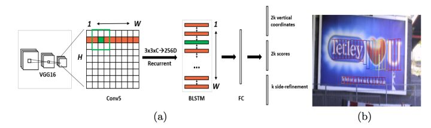

**如何训练**

1. 方框尽可能贴紧字符边缘

2. 框与框之间的分割保持原来行文本的语义，不做语义上的改动。但前提是两个框之间的距离不太宽

   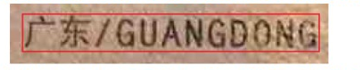

   但签证上的日期字段由于三部分相隔较远，所以需要分割成3块

   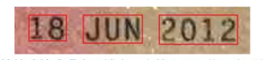

3. 字符被遮挡或者曝光区域小于字符总面积一半（待定）时也应该框

4. 字符在图片外区域小于一半(待定) 时也需要标注

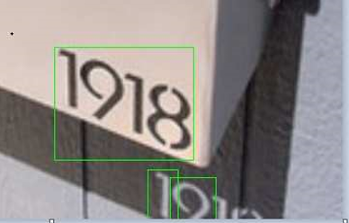

5. 对于一些特殊的字符，例如中文 “一” 。 假设有个人名字是张一且 张和一字中间有较宽的距离，此时可以不分成2个框而是框一个
6. 图片里杭文本的模糊与否都需要标注。（参考开源数据集的标注结果）
7. 护照上的小字行也需要标注，除非实在是模糊得一点字迹都没有了

