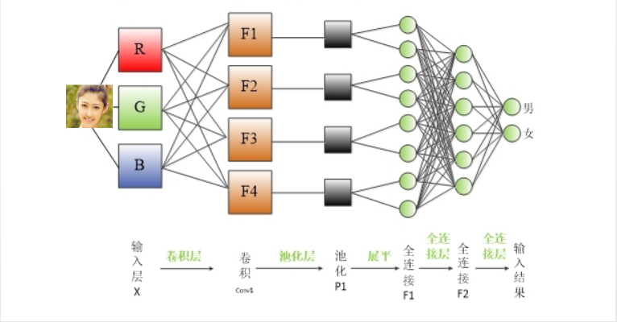

# 神经网络

## CNN

卷积神经网络（Convolutional Neural Network，CNN）, 一种前馈型神经网络。

**CNN的层级结构**

> 1. 输入层
>
>    图像预处理：去均值；归一化；PCA/SVD降维
>
> 2. 卷积层
>
> 3. 激励层
>
>    对卷积层的结果做非线性的映射。
>    常见激励函数：Sigmoid; Tanh(双曲正切)；ReLU; Leaky ReLU；ELU
>
> 4. 池化层 （下采样，欠采样）
>
>    特征降维，压缩数据和参数的数量，减小过拟合，提高模型的容错性。
>
> 5. 输出层（全连接层）
>
> 卷积层、池化层和激励层等操作是将原始数据映射到隐层特征空间的话，全连接层是将学到的“分布式特征表示”映射到样本标记空间的作用

> **卷积**： 卷积的过程是在图像上的每个位置进行线性变换映射成新值的过程，可以将卷积核看出权重。以函数方式可以表示为：将图像对应位置的像素拉成向量记为x，卷积核拉成向量记为w，则对该位置进行卷积结果为 y = wx +b，b为向量内积的偏置。
>
> 卷积神经网络中的三个基本概念：
>
> **局部感受野（Local Receptive Fields）**: 对于一般的深度神经网络，通常把图像的每一个像素点连接到全连接的每一个神经元中，而卷积神经网络则把每一个隐藏节点只连接到图像的某个局部区域，从而减少参数训练的数量。卷积神经网络观看一张图像时，更多的关注的是局部。
>
> **共享权值（Shared Weights）**：卷积神经网络的卷积层中，神经元对应的权值是相同的。共享的权值和偏置业称为卷积核或者滤汲器
>
> **池化（Pooling）**：对图像进行压缩，有效获取图像的特征。对图像进行卷积之后，通过下采样过程，调整图像大小。
>
> 

