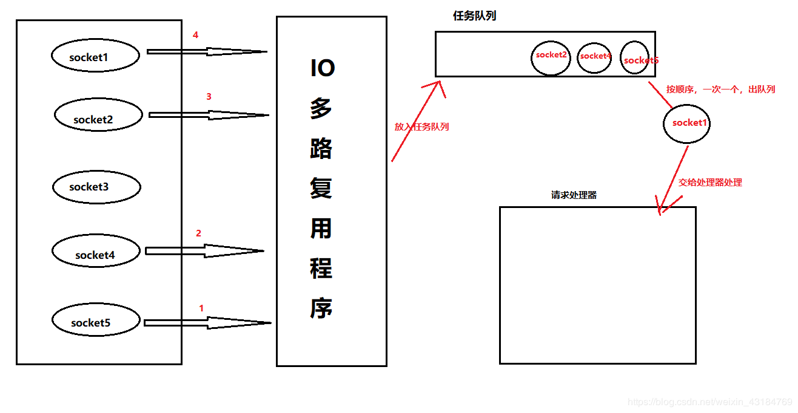

# Redis部署模式

> 1. 主从
>
>    通过持久化，Redis保证了即使在服务器重启的情况下也不会损失数据。避免了单点故障，通常的做法是将数据库复制多个副本以部署在不同的服务器上。 
>
> 2. 哨兵
>
>    当主数据库遇到异常中断时，开发者可以通过手动的方式选择一个从数据库升级为主数据库。
>    哨兵的作用是监控redis主从数据库是否正常运行，主数据库出现故障时，自动将从数据库转换为主数据库。
>
> 3. 集群
>
>    即使使用哨兵，redis每个实例也是全量存储，每个redis存储的内容都是完整的数据，浪费内存且有木桶效应。为了最大化利用内存，可以采用集群，就是分布式存储，即每台redis存储不同的内容。

# 数据更新策略
> 1. Cache Aside Pattern
>
>    失效：应用程序从cache中取数据，没有得到，从数据库中取数据，成功后，放到缓存中。
>    命中：从cache中取数据，取到后返回。
>    更新：先更新数据库，成功后，再让缓存失效。
>
> 2. Read/Write Through Pattern
>
>    对于第一种方案来说，我们应用代码都需要维护两个数据存储，一个是缓存cache，一个是数据库，而Read/Write Through 是把更新数据库的操作由缓存自己代理了
>
>    Read Through  在查询中更新缓存
>    Write Through 在更新数据库发生，先更新缓存，由cache自己去更新数据库，没有命中缓存，直接更新数据库。
>
> 3. Write Behind Caching Pattern
>
>    Write back： Linux文件系统的Page Cache算法
>     在更新数据库时，只更新缓存，不更新数据库，而我们的缓存会异步地批量更新数据库。这个设计的好处是让数据库的I/O操作飞快无比；因为异步，write back还可以合并对同一个数据库的多次操作。
>     缺点：数据不是强一致性。

# 持久化

> 1. Snapshotting （快照）
>
>    默认持久化方式是快照方式，将内存中的数据以快照方式写到二进制文件中，文件名默认是dump.rdb
>
>    可以配置redis在n秒内超过m个key被修改就自动做快照
>
> - save 900 1 #900 秒内如果超过 1 个 key 被修改，则发起快照保存
>
> - save 300 10 #300 秒内容如超过 10 个 key 被修改，则发起快照保存
>
>   快照保存过程
>
>   1. redis调用fork，有了父子进程
>   2. 父进程继续处理client请求，子进程将内容写到临时文件。
>   3. 子进程将快照写到临时文件完毕后，临时文件替换原来的快照文件，子进程退出。

> 2. AOF方式
>
>    ​	快照方式保存数据时有一定的间隔时间，如果redis意外down机，会丢失掉一些数据，AOF则不会有这个问题。
>
>    ​	redis会将每个收到的写命令都会通过write函数追加到文件中。当redis重启时会重新执行文件保存的写命令来重建内存数据，由于 os 会在内核中缓存 write 做的修改，所以可能不是立即写到磁盘上。这样 aof 方式的持久化也还是有可能会丢失部分修改。
>
>    可以配置持久化方式来避免：
>
> - appendonly yes //启用 aof 持久化方式
> - appendfsync always //收到写命令就立即写入磁盘，最慢，但是保证完全的持久化
> - appendfsync everysec //每秒钟写入磁盘一次，在性能和持久化方面做了很好的折中
> - appendfsync no //完全依赖 os，性能最好,持久化没保证
>
> aof 导致持久化文件越来越大的问题：
>
> 可以通过brrewriteaof命令压缩持久化文件，收到这个命令后，redis将使用与快照类似的方式，将内存数据以命令的方式保存到临时文件中，最后替换原来的文件

# Redis的内存淘汰

> **Redis处理内存使用完时：**
>
> ​	noeviction(默认策略)：对于写请求不再提供服务，直接返回错误（DEL请求和部分特殊请求除外）
>
> ​	allkeys-lru：从所有key中使用LRU算法进行淘汰
>
> ​	volatile-lru：从设置了过期时间的key中使用LRU算法进行淘汰
>
> ​	allkeys-random：从所有key中随机淘汰数据
>
> ​	volatile-random：从设置了过期时间的key中随机淘汰
>
> ​	volatile-ttl：在设置了过期时间的key中，根据key的过期时间进行淘汰，越早过期的越优先被淘汰
>
> ​	当使用volatile-lru、volatile-random、volatile-ttl这三种策略时，如果没有key可以被淘汰，则和noeviction一样返回错误

> LRU(Least Recently Used)，即最近最少使用，是一种缓存置换算法。在使用内存作为缓存的时候，缓存的大小一般是固定的。当缓存被占满，这个时候继续往缓存里面添加数据，就需要淘汰一部分老的数据，释放内存空间用来存储新的数据。这个时候就可以使用LRU算法了。其核心思想是：如果一个数据在最近一段时间没有被用到，那么将来被使用到的可能性也很小，所以就可以被淘汰掉。

> Redis3.0对近似LRU的优化
>
> Redis3.0对近似LRU算法进行了一些优化。新算法会维护一个候选池（大小为16），池中的数据根据访问时间进行排序，第一次随机选取的key都会放入池中，随后每次随机选取的key只有在访问时间小于池中最小的时间才会放入池中，直到候选池被放满。当放满后，如果有新的key需要放入，则将池中最后访问时间最大（最近被访问）的移除。
>
> 当需要淘汰的时候，则直接从池中选取最近访问时间最小（最久没被访问）的key淘汰掉就行

# Redis为什么这么快

1. 基于内存

2. 单线程

   > redis的核心处理，即处理网络请求只有一个线程，减少了线程切换的时间消耗

3. IO多路复用

   > 先解释下笼统的IO多路复用模型
   >
   > 1. 传统的多进程并发模型：每监听到一个socket连接，就会分配一个线程处理
   >
   > 2. 多路复用模型：单个线程，通过记录跟踪每一个socket连接的IO状态，来管理多个IO流
   >
   >    （这里的IO指`网络IO`，多路指`多个网络连接`，复用指`复用一个线程`）
   >
   > 再说redis的IO多路复用模型
   >
   > 1. IO多路复用模型会监听多个客户端的socket连接
   >
   > 2. 每当有客户端向redis发出请求时，IO多路复用模型会将请求放进队列中
   >
   > 3. IO多路复用模型每次将队列中的一个任务交给处理器处理
   >
   > 4. IO多路复用模型会有序，同步的处理队列中的任务
   >
   >    