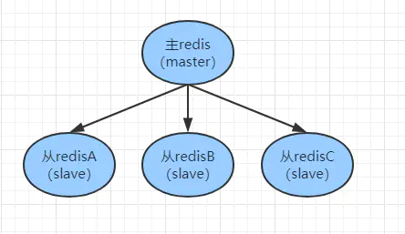
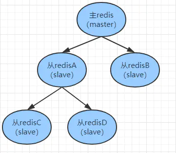
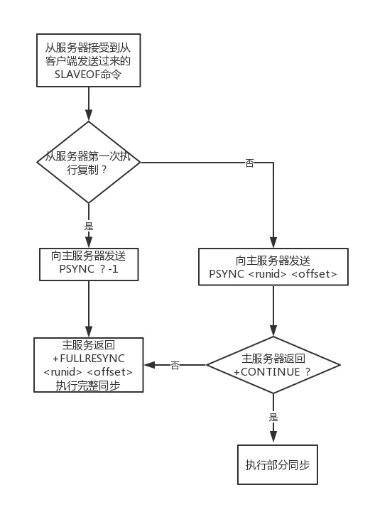
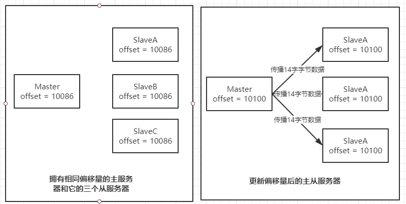
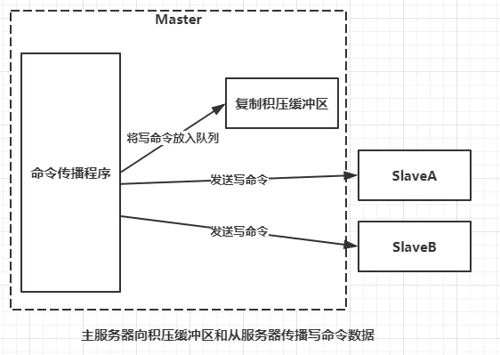
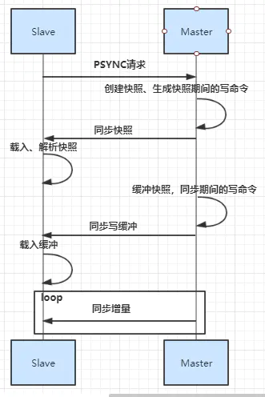
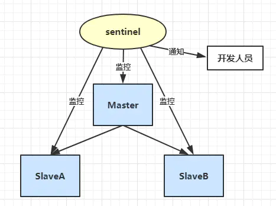
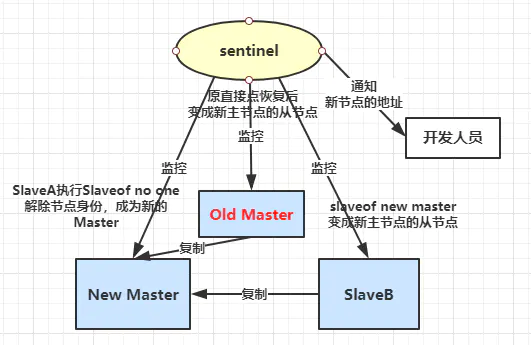
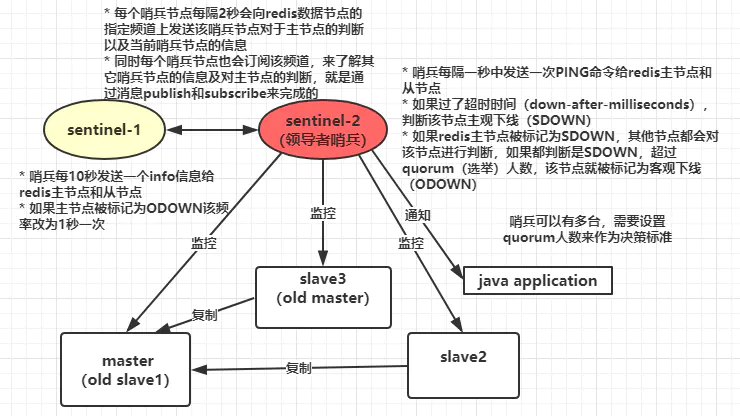

原文: https://www.jianshu.com/p/40212051ccc9

# Redis|主从复制与哨兵机制

## 1. Redis主从复制

### 1.1 Redis主从复制



- Redis主从复制主要有两个角色，主机（master）对外提供读写功能，从机（slave）对外只提供读功能，主机定期把数据同步到从机上保证数据一致性。

- Redis主机数据同步到从机上有两种方式，一种是全量同步，另一种是增量同步。

- 主从复制不会阻塞master，在数据同步时，master还可以继续处理客户端请求，因为redis会产生一个新的进程来解决同步问题。

- 一个redis也可以是从也可以是主（树状主从），可以减轻主机压力。

  

### 1.2 Redis主从配置

只需要修改从服务器上的redis.conf文件：


```json
# slaveof <masterip> <masterport>
# 表示当前【从服务器】对应的【主服务器】的IP是192.168.10.135，端口是6379。
slaveof 192.168.10.135 6379
```

启动主服务器 redis-server redis.conf
 进入从服务器文件夹,启动从服务器
 查看主服务器信息:redis-cli -p 6379 info Replication,可以看到有几个从服务器

### 1.3 实现原理

- redis的主从同步分为两种，分为全量同步和增量同步。

- 只有从机第一次连接上主机是全量同步。

- 断线重连很有可能触发全量同步也有可能是增量同步（master判断runid`是否一致）。

  

  runid

  每个redis服务器，不论主服务器还是从服务，都会有自己的运行id。PSYNC runid  这个命令，runid是指上一次复制主服务器的运行id，如果没有保存这个id，PSYNC的命令会使用”PSYNC ? -1” 这种形式发送给Master，请求主服务器进行全量复制。

**offset（复制偏移量）**
 主服务器和从服务器会分别维护一个复制偏移量，主服务器每次向从服务器传播N个字节的数据时，就将自己的复制偏移量的值加上N，从服务器每次收到主服务器传播来的N个字节的数据时，就将自己的复制偏移量值加上N。




**复制积压缓冲区**
 复制积压缓冲区是由主服务器维护一个固定长度（fixed-size）先进先出（FIFO）队列，默认大小是1MB。它主要的作用就是当主服务器进行命令传播时，不仅将命令发送给所有从服务器，还会将命令入队到复制积压缓冲区。如果主服务器向从服务器传播数据时发生断线，主服务器会将复制积压缓冲区偏移量的所有数据都发送给从服务器（发送的是断线之后的的数据）。




**PSYNC执行过程**
 1.Slave接受从客户端发送过来的SLAVEOF命令。

1. 当前服务器判断自己是否保存Master runid是否是第一次复制。
2. 如果是第一次复制那么当前服务器向Master发送PSYNC ？ -1命令，主动请求Master进行全量同步。
3. 如果已经父之过Master，那么当前从服务器向Master发送PSYNC runid offset命令。
4. Master接收到PSYNC 命令后首先判断runid是否和本机的id一致，如果runid和本机id不一致则返回+FULLRESYNC runid offset命令执行全量同步操作，当前服务器会将runid保存起来，在下次发送PSUNC时使用。
5. 如果判断runid和本机id一致，Master则会再次判断offset偏移量和本机的偏移量相差有没有超过复制积压缓冲区大小，如果没有那么就给Slave发送CONTINUE，此时Slave只需要等待Master传回失去连接期间丢失的命令；

**全量同步**
 Redis的全量同步主要分为三个阶段：

- 同步快照阶段：Master创建并发送快照给Slave，Slave再入快照并解析。Master同时将此阶段产生的新的命令写入到积压缓冲区中。

- 同步写缓冲阶段：Master向Slave同步存储在缓冲区的写操作命令。

- 同步增量阶段：Master向SLave同步写操作命令。

  

  增量同步

- Redis增量同步主要是指Slave完成初始化开始正常工作时，Master发生的写操作同步到Slave的过程。

- 通常情况下，Master没执行一个写命令就会想Slave发送相同的写命令，然后Slave接受并执行。

## 2. 哨兵（sentinel）机制

### 2.1 哨兵机制介绍

- sentinel进程是用于监控Redis集群中Master主服务器工作的状态。
- 在Master主服务器发生故障的时候，可以实现Master和Slave服务器的切换，保证系统的高可用。

### 2.2 为什么要有哨兵机制？

Redis主从复制的缺点：没有办法对master进行动态选举，需要使用Sentinel机制完成动态选举。

### 2.3 哨兵的作用

- **监控（Monitoring）：**sentinel会不断检查Master和Slave是否运行正常。

- **提醒（Notification）：**当被监控的某个Redis节点出现问题时, sentinel 可以通过 API向管理员或者其他应用程序发送通知。

  

  

- **自动故障转移（Automatic failover）：**当Master不能正常操作时哨兵会开始一次故障转移。

  - 它会将失效的Master的其中一个Slave升级为新的Master，并让其他Slave改为复制新的Master。

  - 当客户端试图连接失效的Master时，集群会向客户端显示新的Master的地址。

  - Master和Slave切换后，Master的redis.conf、Slave的reids.conf和senisentinel的sentinel.conf配置文件的内容都会相应的改变，即，Master主服务器的redis.conf配置文件中会多一行slaveof的配置，sentinel.conf的监控目标会随之调换。

    

### 2.4 故障判断原理分析

1. 每个sentinel进程每秒钟一次的频率向整个集群中Master、Slave以及其它Sentinel进程发送一个PING命令。

2. 如果一个实例（instance）距离最后一次有效回复PING命令超过down-after-milliseconds选项所指定的值，这个实例会被sentinel进程标记为主观下线（SDOWN）。

3. 如果一个Master主服务器被标记为主观下线（SDOWN），则正在监视这个Master主服务器的所有 Sentinel进程要以每秒一次的频率确认Master主服务器的确进入了主观下线状态。

4. 当有足够数量的 Sentinel进程（大于等于配置文件指定的值）在指定的时间范围内确认Master主服务器进入了主观下线状态（SDOWN）， 则Master主服务器会被标记为客观下线（ODOWN）。

5. 在一般情况下， 每个 Sentinel进程会以每 10 秒一次的频率向集群中的所有Master主服务器、Slave从服务器发送 INFO 命令。

6. 当Master主服务器被 Sentinel进程标记为客观下线（ODOWN）时，Sentinel进程向下线的 Master主服务器的所有 Slave从服务器发送 INFO 命令的频率会从 10 秒一次改为每秒一次。

7. 若没有足够数量的 Sentinel进程同意 Master主服务器下线， Master主服务器的客观下线状态就会被移除。若 Master主服务器重新向 Sentinel进程发送 PING 命令返回有效回复，Master主服务器的主观下线状态就会被移除。

   

### 2.5 配置

修改从机的**sentinel.conf**：


```properties
# 哨兵sentinel监控的redis主节点的 ip port 
# master-name  可以自己命名的主节点名字 只能由字母A-z、数字0-9 、这三个字符".-_"组成。
# quorum 当这些quorum个数sentinel哨兵认为master主节点失联 那么这时 客观上认为主节点失联了
# sentinel monitor <master-name> <master ip> <master port> <quorum>
sentinel monitor mymaster 192.168.10.133 6379 1
```

**sentinel.conf**说明：


```properties
# 哨兵sentinel实例运行的端口 默认26379
port 26379
 
# 哨兵sentinel的工作目录
dir /tmp
 
# 哨兵sentinel监控的redis主节点的 ip port 
# master-name  可以自己命名的主节点名字 只能由字母A-z、数字0-9 、这三个字符".-_"组成。
# quorum 当这些quorum个数sentinel哨兵认为master主节点失联 那么这时 客观上认为主节点失联了
# sentinel monitor <master-name> <ip> <redis-port> <quorum>
sentinel monitor mymaster 127.0.0.1 6379 2
 
# 当在Redis实例中开启了requirepass foobared 授权密码 这样所有连接Redis实例的客户端都要提供密码
# 设置哨兵sentinel 连接主从的密码 注意必须为主从设置一样的验证密码
# sentinel auth-pass <master-name> <password>
sentinel auth-pass mymaster MySUPER--secret-0123passw0rd
 
 
# 指定多少毫秒之后 主节点没有应答哨兵sentinel 此时 哨兵主观上认为主节点下线 默认30秒
# sentinel down-after-milliseconds <master-name> <milliseconds>
sentinel down-after-milliseconds mymaster 30000
 
# 这个配置项指定了在发生failover主备切换时最多可以有多少个slave同时对新的master进行 同步，
这个数字越小，完成failover所需的时间就越长，
但是如果这个数字越大，就意味着越 多的slave因为replication而不可用。
可以通过将这个值设为 1 来保证每次只有一个slave 处于不能处理命令请求的状态。
# sentinel parallel-syncs <master-name> <numslaves>
sentinel parallel-syncs mymaster 1
 
 
 
# 故障转移的超时时间 failover-timeout 可以用在以下这些方面： 
#1. 同一个sentinel对同一个master两次failover之间的间隔时间。
#2. 当一个slave从一个错误的master那里同步数据开始计算时间。直到slave被纠正为向正确的master那里同步数据时。
#3.当想要取消一个正在进行的failover所需要的时间。  
#4.当进行failover时，配置所有slaves指向新的master所需的最大时间。不过，即使过了这个超时，slaves依然会被正确配置为指向master，但是就不按parallel-syncs所配置的规则来了
# 默认三分钟
# sentinel failover-timeout <master-name> <milliseconds>
sentinel failover-timeout mymaster 180000
 
# SCRIPTS EXECUTION
 
#配置当某一事件发生时所需要执行的脚本，可以通过脚本来通知管理员，例如当系统运行不正常时发邮件通知相关人员。
#对于脚本的运行结果有以下规则：
#若脚本执行后返回1，那么该脚本稍后将会被再次执行，重复次数目前默认为10
#若脚本执行后返回2，或者比2更高的一个返回值，脚本将不会重复执行。
#如果脚本在执行过程中由于收到系统中断信号被终止了，则同返回值为1时的行为相同。
#一个脚本的最大执行时间为60s，如果超过这个时间，脚本将会被一个SIGKILL信号终止，之后重新执行。
 
#通知型脚本:当sentinel有任何警告级别的事件发生时（比如说redis实例的主观失效和客观失效等等），将会去调用这个脚本，这时这个脚本应该通过邮件，SMS等方式去通知系统管理员关于系统不正常运行的信息。调用该脚本时，将传给脚本两个参数，一个是事件的类型，一个是事件的描述。
#如果sentinel.conf配置文件中配置了这个脚本路径，那么必须保证这个脚本存在于这个路径，并且是可执行的，否则sentinel无法正常启动成功。
#通知脚本
# sentinel notification-script <master-name> <script-path>
sentinel notification-script mymaster /var/redis/notify.sh
 
# 客户端重新配置主节点参数脚本
# 当一个master由于failover而发生改变时，这个脚本将会被调用，通知相关的客户端关于master地址已经发生改变的信息。
# 以下参数将会在调用脚本时传给脚本:
# <master-name> <role> <state> <from-ip> <from-port> <to-ip> <to-port>
# 目前<state>总是“failover”,
# <role>是“leader”或者“observer”中的一个。 
# 参数 from-ip, from-port, to-ip, to-port是用来和旧的master和新的master(即旧的slave)通信的
# 这个脚本应该是通用的，能被多次调用，不是针对性的。
# sentinel client-reconfig-script <master-name> <script-path>
 sentinel client-reconfig-script mymaster /var/redis/reconfig.sh
```

**通过redis-sentinel启动哨兵服务**


```bash
./redis-sentinel sentinel.conf
```

