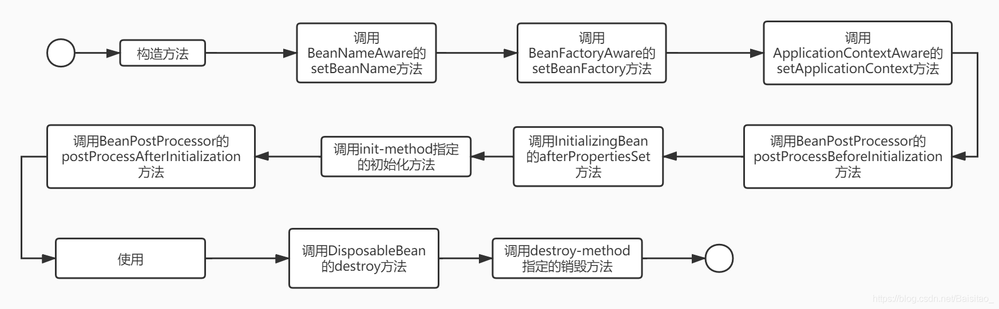
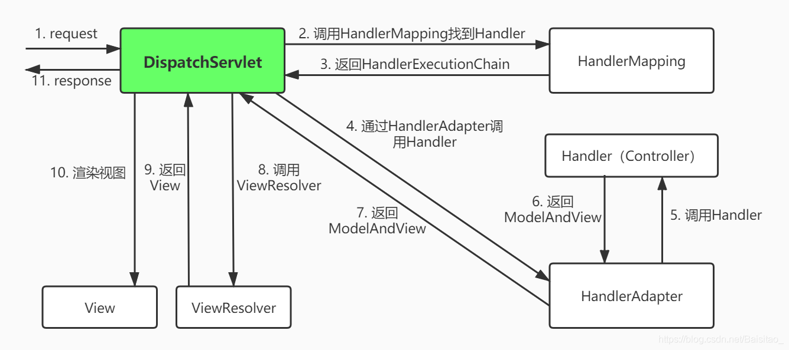

原文：https://blog.csdn.net/Baisitao_/article/details/105151646

# 面试前突击Spring，我只需要十分钟

## 前言

作为一个写Java的程序员，应该不太可能没听过Spring。对开发者来说，Spring就像是哆啦A梦的口袋。无论需要什么道具，都可以从口袋里直接拿出来，而不用关心这些道具来自哪里。

本篇主要记录一些关于Spring的基础知识，**用于快速查找和回顾**，**不适合作为Spring的入门学习**（头铁的旁友随意）。

## 核心

Spring的两大核心当属**IOC**和**AOP**。

### IOC

IOC是控制反转(**I**nversion **O**f **C**ontrol)，IOC是一种**编程思想**。Spring的IOC容器实现了IOC，是Spring框架的基本功能，管理着Spring应用中bean的**创建**、**配置**和**管理**。Spring的IOC容器接管了应用中的bean，能够自动解决bean与bean之间的依赖。

> 传统应用程序是由我们自己在对象中主动控制去直接获取依赖对象，也就是正转；而反转则是由容器来帮忙创建及注入依赖对象；因为由容器帮我们查找及注入依赖对象，对象只是被动的接受依赖对象，所以是反转。因此反转是指：依赖对象的获取被反转了。

IOC容器对使用者来说就像是一个黑盒，不需要关心bean之间的依赖是怎样的，大大减少了编程的难度。

IOC的实现方式有两种：**依赖注入**（Dependency Injection，DI）和**依赖查找**（Dependency Lookup，DL）

- 依赖注入：应用程序被动的接收对象，bean实例化的时候，IOC容器会自动根据类型或者名称，把依赖的其他bean注入给当前bean。依赖注入的方式主要有以下四种：
  - **注解**：通过注解来让IOC容器注入所依赖类型的对象，例如最常用的`@Autowired`。
  - **构造方法**：实现对应参数的构造方法，在创建对象时来让IOC容器注入所依赖类型的对象。
  - **`setter`方法**：实现对应属性的`setter`方法，来让IOC容器注入所依赖类型的对象。
  - **接口**：实现特定接口以，让IOC容器注入所依赖类型的对象。
- **依赖查找**：依赖查找是容器中的对象，通过容器的API，来查找自己所依赖的资源和对象。相比于**依赖注入**，**依赖查找**是一种更加主动的方式。

| 类型         | 依赖处理 | 实现便利性 | 代码侵入性   | API依赖性     | 可读性 |
| ------------ | -------- | ---------- | ------------ | ------------- | ------ |
| **依赖查找** | 主动获取 | 相对繁琐   | 侵入业务逻辑 | 依赖容器API   | 良好   |
| **依赖注入** | 被动提供 | 相对便利   | 低侵入性     | 不依赖容器API | 一般   |

### AOP

AOP(**A**spect-**O**riented **P**rogramming)即**面向切面编程**，是一种完全不同于OOP的**编程思想**。AOP不是用来取代OOP的，反而是来补充OOP的。

OOP的思想把项目分为**层次结构**，是一种**从上到下**的结构。这种上下结构想要做到从**左到右**是一件非常繁琐的事。这种**从左到右**的需求往往是一些诸如**日志**、**安全**、**事务**等，非业务性的功能。这样的功能如果按照OOP的思想来实现，就会导致大量冗余、侵入性强的代码。所以AOP的作用就是剥离一些非业务代码，做到统一管理。

AOP的功能就是在**运行时**，把指定的代码**动态的**加入到指定的地方，来完成一些非业务逻辑的功能，从而避免手动编写这些代码。

AOP往往采用**动态代理**的方式来实现。

## 作用域

Spring bean的作用域主要有五种：

- `singleton`：在整个Spring IoC容器仅存在一个Bean实例，Bean以**单例**方式存在。`singleton`是Spring的**默认**配置。
- `prototype`：**每次**从Spring IoC容器中获取Bean时，都返回一个**新的实例**。
- `request`：每次HTTP请求都会创建一个新的Bean实例。该作用域仅适用于Spring构建的web环境。
- `session`：同一个HTTP Session共享一个Bean，不同Session使用不同的Bean。该作用域仅适用于Spring构建的web环境。
- `application`：限定一个Bean的作用域为整个web应用。该作用域仅适用于Spring构建的web环境。

## 实例化

Spring中的`bean`的实例化主要有三种方式

- **无参构造方法**，这种方式最常用
- 使用静态工厂
- 使用实例工厂

## 注入方式

属性的注入有两种方式：`byType`和`byName`。

- byType：如果容器中存在一个与指定属性类型相同的bean，那么将该属性自动装配。比如在Controller注入

  Service

  ```Java
  private IUserService userService
  ```

  byType方式会自动注入IUserService的实现类UserServiceImpl，如果实现类有多个，默认会抛出异常。下文讲述如何解决。

- byName：通过属性名称自动装配。比如在Controller注入Service

  ```Java
  private IUserService userService
  ```

  通过byName的方式需要指定实现类UserServiceImpl的Name

  ```Java
  @Service("userService")
  public class UserServiceImpl implements IUserService {...}
  12
  ```

## 事务隔离级别

Spring提供了五种隔离级别：

- `DEFAULT`（默认）：意思就是数据库用啥我用啥
- `SERIALIZABLE`（串行化）：事务之间以一种串行的方式执行
- `REPEATABLE READ`（可重复读）：是MySQL默认的隔离级别，同一个事务中相同的查询会看到同样的数据行
- `READ COMMITED`（读已提交）：一个事务可以读到另一个事务已经提交的数据
- `READ UNCOMMITED`（读未提交）：一个事务可以读到另一个事务未提交的数据

除了第一个是Spring新增的，其余的四个都是和**数据库的事务隔离级别**一一对应。不了解数据库事务隔离级别的旁友翻下这篇：[面试官：MySQL事务是怎么实现的](https://blog.csdn.net/Baisitao_/article/details/104723795)

## 事务传播机制

事务传播机制是指在一个可能含有事务的方法中，调用了另一个可能含有事务的方法，这两个事务应该如何去取舍。最常见的场景就是在Service层。比如`OrderService#createOrder()`方法里调用了`StockService#decreaseStock()`，而这两个方法明显都是有事务的。这时，两个事务如何相互影响就是事务传播机制。

Spring提供了七种事务传播机制：

- `REQUIRED`：Spring**默认值**，如果存在事务，则加入当前事务；如果没有事务，则开启一个新的事务。
- `REQUIRES_NEW`：如果当前存在事务，把当前事务挂起，新建事务。
- `SUPPORTS`：支持当前事务，如果当前没有事务，就以非事务方式执行。
- `NOT_SUPPORTED`：以非事务方式执行操作，如果当前存在事务，就把当前事务挂起。
- `MANDATORY`：如果当前存在事务，则加入当前事务；如果没有事务，就抛出异常。
- `NEVER`：以非事务方式执行，如果当前存在事务，则抛出异常。
- `NESTED`：支持当前事务，新增Savepoint，与当前事务同步提交或回滚。外层事务失败时，会回滚内层事务所做的动作。而内层事务操作失败并不会引起外层事务的回滚。

## 生命周期

Spring管理了对象的生命周期，所以有必要了解Spring到底是怎么管理bean的生命周期的。如果我们想要在bean生命周期的某个时刻执行特定的功能应该怎么办？

Spring bean的生命周期颇为复杂，以下是整个过程，参考`org.springframework.beans.factory.BeanFactory`


## 常用注解

### 标识类

- `@Component`：标识此类由Spring IOC容器管理
- `@Controller`：标识此类是接收和转发请求用的`Controller`类，是`@Component`的细化注解
- `@Service`：标识此类是处理业务逻辑的`Service`类，是`@Component`的细化注解
- `@Repository`：标识此类是处理**持久化**操作相关的类，通常是`XxxDao`，是`@Component`的细化注解

### 注入类

- @Autowired：属于Spring，是根据类型（byType）的方式自动注入属性，默认是必须的。如果要设置成可选，需要把required设置成false

  ```Java
  @Autowired(required = false)
  private IUserService userService;
  ```

  如果IUserService的实现类不止一个，默认会报错。需要配合注解@Qualifier指定具体的实现类

  ```Java
  public interface IUserService {
  }
  
  @Component("helloUserService")
  public class HelloUserServiceImpl implements IUserService {
  }
  
  @Component("worldUserService")
  public class WorldUserServiceImpl implements IUserService {
  }
  ```

  正确注入方式

  ```Java
  @Autowired
  @Qualifier("helloUserService")
  private IUserService userService;
  ```

- `@Qualifier`：见`@Autowired`

- @Resource属于JDK，默认是按照名称（byName）进行装配的。

  - 如果没有指定`name`属性，默认取字段的名称作为bean名称寻找依赖对象。
  - 如果没有指定`name`属性，且`byName`的方式无法装配，则会按照`byType`的方式进行装配。
  - 如果仅指定的`type`属性，也会通过`byType`的方式进行装配，找不到或者找到多个都会抛异常。
  - 只要指定了`name`属性，就不会再按照`byType`的方式进行装配。

- `@Value`：用于注入一些配置文件中的常量，如jdbc相关的配置等

### web相关

- `@RequestMapping`：这个注解会将HTTP请求映射到`Controller`的处理方法上。

  ```Java
  // 简单用法
  @RequestMapping("/index")
  
  // 映射多个url
  @RequestMapping({"/index", "/home"})
  
  // 限制请求方式为Post，等同于注解 @PostMapping("/index")
  @RequestMapping(value = "/index", method = RequestMethod.POST)
  ```

- `@RequestBody`：将HTTP请求正文插入方法中，用来处理请求的`Content-Type`不是`application/x-www-form-urlencoded`（表单）编码的内容，例如：`application/json`、`application/xml`等。也就是说当客户端向后台提交数据不是以表单，而是以JSON数据的方式时，可以使用`@RequestBody`注解将数据映射到后台参数列表

  ```Java
  // 前端
  $.ajax({
      type: 'POST',
      dataType: "json",
      contentType: "application/json; charset=utf-8",
      data: JSON.stringify(paramJson),
      url: "",
      success: function (data) {
      }
  });
  
  // 后台
  @RequestMapping("/xxx")
  public Sring xxx(@RequestBody UserDTO userDTO) {
      return "success";
  }
  12345678910111213141516
  ```

- `@RequestParam`：用来辅助绑定特殊要求的参数

  ```Java
  // 表示该接口必须传递参数id
  @RequestMapping("/xxx")
  public String xxx(@RequestParam("id") String id) {
      return "";
  }
  
  // 参数id可以不传
  @RequestMapping("/xxx")
  public String xxx(@RequestParam(name = "id", required = false) String id) {
      return "success";
  }
  1234567891011
  ```

- `@PathVariable`：表示将url中的参数变量绑定到参数列表

  ```Java
  // 将参数列表中的值自动填充到url中的变量中
  @RequestMapping("/order/{orderId}")
  public String xxx(@PathVariable String orderId) {
      return "success";
  }
  
  // 如果参数列表中的参数名和url中的不一致，则需要指定@PathVariable的name属性
  @RequestMapping("/order/{orderId}")
  public String xxx(@PathVariable(name = "orderId") String id) {
      return "success";
  }
  1234567891011
  ```

- `@ResponseBody`：表示该方法的返回的结果直接写入 HTTP 响应正文中，而不是跳转到某个路径，一般用于向客户端返回JSON数据。

  ```Java
  // 把success字符串返回给客户端
  @ResponseBody
  @RequestMapping("/xxx")
  public String xxx() {
     return "success";
  }
  123456
  ```

## SpringMVC请求过程

一图胜千言


## 总结

本篇主要列举了与Spring相关的一些基础知识，包括IOC、AOP、bean的作用域、生命周期、事务传播机制、常用注解等。了解了这些基础知识，能帮助我们更好的使用Spring。