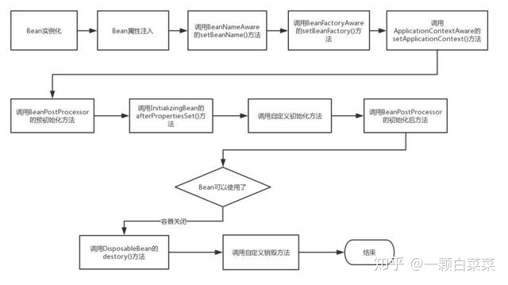
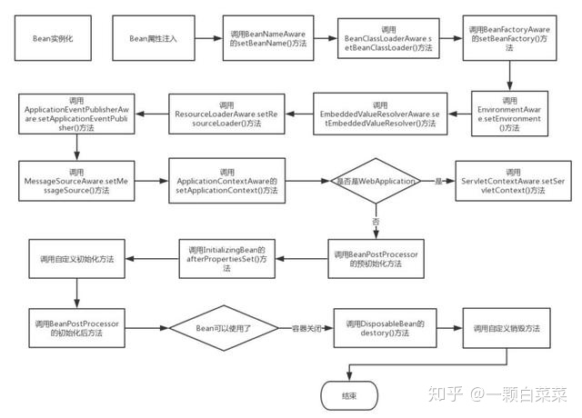

原文：https://zhuanlan.zhihu.com/p/66612645

# 深究Spring中Bean的生命周期

**前言**

这其实是一道面试题，是我在面试百度的时候被问到的，当时没有答出来(因为自己真的很菜)，后来在网上寻找答案，看到也是一头雾水，直到看到了《Spring in action》这本书，书上有对Bean声明周期的大致解释，但是没有代码分析，所以就自己上网寻找资料，一定要把这个Bean生命周期弄明白！

网上大部分都是验证的Bean 在面试问的生命周期，其实查阅JDK还有一个完整的Bean生命周期，这同时也验证了书是具有片面性的，最fresh 的资料还是查阅原始JDK!!!

**一、Bean 的完整生命周期**

在传统的Java应用中，bean的生命周期很简单，使用Java关键字 new 进行Bean 的实例化，然后该Bean 就能够使用了。一旦bean不再被使用，则由Java自动进行垃圾回收。

相比之下，Spring管理Bean的生命周期就复杂多了，正确理解Bean 的生命周期非常重要，因为Spring对Bean的管理可扩展性非常强，下面展示了一个Bean的构造过程




**Bean 的生命周期**

如上图所示，Bean 的生命周期还是比较复杂的，下面来对上图每一个步骤做文字描述:

1. Spring启动，查找并加载需要被Spring管理的bean，进行Bean的实例化
2. Bean实例化后对将Bean的引入和值注入到Bean的属性中
3. 如果Bean实现了BeanNameAware接口的话，Spring将Bean的Id传递给setBeanName()方法
4. 如果Bean实现了BeanFactoryAware接口的话，Spring将调用setBeanFactory()方法，将BeanFactory容器实例传入
5. 如果Bean实现了ApplicationContextAware接口的话，Spring将调用Bean的setApplicationContext()方法，将bean所在应用上下文引用传入进来。
6. 如果Bean实现了BeanPostProcessor接口，Spring就将调用他们的postProcessBeforeInitialization()方法。
7. 如果Bean 实现了InitializingBean接口，Spring将调用他们的afterPropertiesSet()方法。类似的，如果bean使用init-method声明了初始化方法，该方法也会被调用
8. 如果Bean 实现了BeanPostProcessor接口，Spring就将调用他们的postProcessAfterInitialization()方法。
9. 此时，Bean已经准备就绪，可以被应用程序使用了。他们将一直驻留在应用上下文中，直到应用上下文被销毁。
10. 如果bean实现了DisposableBean接口，Spring将调用它的destory()接口方法，同样，如果bean使用了destory-method 声明销毁方法，该方法也会被调用。

> **上面是Spring 中Bean的核心接口和生命周期，面试回答上述过程已经足够了。但是翻阅JavaDoc文档发现除了以上接口外，还有另外的初始化过程涉及的接口：摘自org.springframework.beans.factory.BeanFactory， 全部相关接口如下，上述已有的就不用着重标注，把额外的相关接口着重标注下**





**Bean 完整的生命周期**

文字解释如下：

————————————初始化————————————

- BeanNameAware.setBeanName() 在创建此bean的bean工厂中设置bean的名称，在普通属性设置之后调用，在InitializinngBean.afterPropertiesSet()方法之前调用
- BeanClassLoaderAware.setBeanClassLoader(): 在普通属性设置之后，InitializingBean.afterPropertiesSet()之前调用
- BeanFactoryAware.setBeanFactory() : 回调提供了自己的bean实例工厂，在普通属性设置之后，在InitializingBean.afterPropertiesSet()或者自定义初始化方法之前调用
- EnvironmentAware.setEnvironment(): 设置environment在组件使用时调用
- EmbeddedValueResolverAware.setEmbeddedValueResolver(): 设置StringValueResolver 用来解决嵌入式的值域问题
- ResourceLoaderAware.setResourceLoader(): 在普通bean对象之后调用，在afterPropertiesSet 或者自定义的init-method 之前调用，在 ApplicationContextAware 之前调用。
- ApplicationEventPublisherAware.setApplicationEventPublisher(): 在普通bean属性之后调用，在初始化调用afterPropertiesSet 或者自定义初始化方法之前调用。在 ApplicationContextAware 之前调用。
- MessageSourceAware.setMessageSource(): 在普通bean属性之后调用，在初始化调用afterPropertiesSet 或者自定义初始化方法之前调用，在 ApplicationContextAware 之前调用。
- ApplicationContextAware.setApplicationContext(): 在普通Bean对象生成之后调用，在InitializingBean.afterPropertiesSet之前调用或者用户自定义初始化方法之前。在ResourceLoaderAware.setResourceLoader，ApplicationEventPublisherAware.setApplicationEventPublisher，MessageSourceAware之后调用。
- ServletContextAware.setServletContext(): 运行时设置ServletContext，在普通bean初始化后调用，在InitializingBean.afterPropertiesSet之前调用，在 ApplicationContextAware 之后调用**注：是在WebApplicationContext 运行时**
- BeanPostProcessor.postProcessBeforeInitialization() : 将此BeanPostProcessor 应用于给定的新bean实例 在任何bean初始化回调方法(像是InitializingBean.afterPropertiesSet或者自定义的初始化方法）之前调用。这个bean将要准备填充属性的值。返回的bean示例可能被普通对象包装，默认实现返回是一个bean。
- BeanPostProcessor.postProcessAfterInitialization() : 将此BeanPostProcessor 应用于给定的新bean实例 在任何bean初始化回调方法(像是InitializingBean.afterPropertiesSet或者自定义的初始化方法)之后调用。这个bean将要准备填充属性的值。返回的bean示例可能被普通对象包装
- InitializingBean.afterPropertiesSet(): 被BeanFactory在设置所有bean属性之后调用(并且满足BeanFactory 和 ApplicationContextAware)。

————————————销毁————————————

在BeanFactory 关闭的时候，Bean的生命周期会调用如下方法:

- DestructionAwareBeanPostProcessor.postProcessBeforeDestruction(): 在销毁之前将此BeanPostProcessor 应用于给定的bean实例。能够调用自定义回调，像是DisposableBean 的销毁和自定义销毁方法，这个回调仅仅适用于工厂中的单例bean(包括内部bean)
- 实现了自定义的destory()方法

**二、Bean 的生命周期验证**

为了验证Bean生命周期的过程，有两种形式：一种是为面试而准备的，一种是为了解全过程而准备的，下面来看代码：

Book.class


```text
public class Book implements BeanNameAware,BeanFactoryAware,
        ApplicationContextAware,InitializingBean,DisposableBean {
    private String bookName;
    public Book(){
        System.out.println("Book Initializing ");
    }
    public void setBeanFactory(BeanFactory beanFactory) throws BeansException {
        System.out.println("Book.setBeanFactory invoke");
    }
    public void setBeanName(String name) {
        System.out.println("Book.setBeanName invoke");
    }
    public void destroy() throws Exception {
        System.out.println("Book.destory invoke");
    }
    public void afterPropertiesSet() throws Exception {
        System.out.println("Book.afterPropertiesSet invoke");
    }
    public void setApplicationContext(ApplicationContext applicationContext) throws BeansException {
        System.out.println("Book.setApplicationContext invoke");
    }
    public String getBookName() {
        return bookName;
    }
    public void setBookName(String bookName) {
        this.bookName = bookName;
        System.out.println("setBookName: Book name has set.");
    }
    public void myPostConstruct(){
        System.out.println("Book.myPostConstruct invoke");
    }
     // 自定义初始化方法
    @PostConstruct
    public void springPostConstruct(){
        System.out.println("@PostConstruct");
    }
    public void myPreDestory(){
        System.out.println("Book.myPreDestory invoke");
        System.out.println("---------------destroy-----------------");
    }
    // 自定义销毁方法
    @PreDestroy
    public void springPreDestory(){
        System.out.println("@PreDestory");
    }
    @Override
    protected void finalize() throws Throwable {
        System.out.println("------inside finalize-----");
    }
}
```


自定义实现BeanPostProcessor 的MyBeanPostProcessor：


```text
public class MyBeanPostProcessor implements BeanPostProcessor {
    // 容器加载的时候会加载一些其他的bean，会调用初始化前和初始化后方法
    // 这次只关注book(bean)的生命周期
    public Object postProcessBeforeInitialization(Object bean, String beanName) throws BeansException {
        if(bean instanceof Book){
            System.out.println("MyBeanPostProcessor.postProcessBeforeInitialization");
        }
        return bean;
    }
    public Object postProcessAfterInitialization(Object bean, String beanName) throws BeansException {
        if(bean instanceof Book){
            System.out.println("MyBeanPostProcessor.postProcessAfterInitialization");
        }
        return bean;
    }
}
 
```


在resources 目录下新建Bean-Lifecycle.xml

```text
<beans xmlns="http://www.springframework.org/schema/beans"
       xmlns:xsi="http://www.w3.org/2001/XMLSchema-instance"
       xmlns:context="http://www.springframework.org/schema/context"
       xsi:schemaLocation="http://www.springframework.org/schema/beans
http://www.springframework.org/schema/beans/spring-beans-2.5.xsd http://www.springframework.org/schema/context http://www.springframework.org/schema/context/spring-context.xsd">
      <!-- 扫描bean -->
    <context:component-scan base-package="com.bean.lifecycle"/>
    <!-- 实现了用户自定义初始化和销毁方法 -->
    <bean id="book" class="com.bean.lifecycle.Book" init-method="myPostConstruct" destroy-method="myPreDestory">
          <!-- 注入bean 属性名称 -->
        <property name="bookName" value="thingking in java" />
    </bean>
      <!--引入自定义的BeanPostProcessor-->
    <bean class="com.bean.lifecycle.MyBeanPostProcessor"/>
</beans>
```


做一个启动类的测试，新建SpringBeanLifecycleApplication


```text
public class SpringBeanLifecycleApplication {
    public static void main(String[] args) throws InterruptedException {
        // 为面试而准备的Bean生命周期加载过程
        ApplicationContext context = new ClassPathXmlApplicationContext("Bean-Lifecycle.xml");
        Book book = (Book)context.getBean("book");
        System.out.println("Book name = " + book.getBookName());
        ((ClassPathXmlApplicationContext) context).destroy();
    }
}
```


启动测试，输出结果如下：


```text
Book Initializing 
setBookName: Book name has set.
Book.setBeanName invoke
Book.setBeanFactory invoke
Book.setApplicationContext invoke
MyBeanPostProcessor.postProcessBeforeInitialization
@PostConstruct
Book.afterPropertiesSet invoke
Book.myPostConstruct invoke
MyBeanPostProcessor.postProcessAfterInitialization
Book name = thingking in java
@PreDestory
Book.destory invoke
Book.myPreDestory invoke
---------------destroy-----------------
```


为了验证Bean完整的生命周期，需要新建一个SubBookClass 继承Book类


```text
public class SubBookClass extends Book implements BeanClassLoaderAware,
        EnvironmentAware,EmbeddedValueResolverAware,ResourceLoaderAware,
        ApplicationEventPublisherAware,MessageSourceAware{
    private String bookSystem;
    public String getBookSystem() {
        return bookSystem;
    }
    public void setBookSystem(String bookSystem) {
        System.out.println("设置BookSystem 的属性值");
        this.bookSystem = bookSystem;
    }
    public void setBeanClassLoader(ClassLoader classLoader) {
        System.out.println("SubBookClass.setBeanClassLoader() 方法被调用了");
    }
    public void setApplicationEventPublisher(ApplicationEventPublisher applicationEventPublisher) {
        System.out.println("SubBookClass.setApplicationEventPublisher() 方法被调用了");
    }
    public void setEmbeddedValueResolver(StringValueResolver resolver) {
        System.out.println("SubBookClass.setEmbeddedValueResolver() 方法被调用了");
    }
    public void setEnvironment(Environment environment) {
        System.out.println("SubBookClass.setEnvironment() 方法被调用了");
    }
    public void setMessageSource(MessageSource messageSource) {
        System.out.println("SubBookClass.setMessageSource() 方法被调用了");
    }
    public void setResourceLoader(ResourceLoader resourceLoader) {
        System.out.println("SubBookClass.setResourceLoader() 方法被调用了");
    }
}
```


> 上述SubBookClass类与Book是互补关系。

新建一个SubBean-Lifecycle.xml，注入SubBookClass


```text
<beans xmlns="http://www.springframework.org/schema/beans"
       xmlns:xsi="http://www.w3.org/2001/XMLSchema-instance"
       xmlns:context="http://www.springframework.org/schema/context"
       xsi:schemaLocation="http://www.springframework.org/schema/beans
http://www.springframework.org/schema/beans/spring-beans-2.5.xsd http://www.springframework.org/schema/context http://www.springframework.org/schema/context/spring-context.xsd">
    <bean id="bookClass" class="com.bean.lifecycle.SubBookClass" init-method="myPostConstruct" destroy-method="myPreDestory">
        <property name="bookSystem" value="Java System" />
    </bean>
    <bean class="com.bean.lifecycle.MyBeanPostProcessor"/>
</beans>
```


完整的SpringBeanLifecycleApplication 如下：

```text
public class SpringBeanLifecycleApplication {
    public static void main(String[] args) throws InterruptedException {
        // 为面试而准备的Bean生命周期加载过程
        ApplicationContext context = new ClassPathXmlApplicationContext("Bean-Lifecycle.xml");
        Book book = (Book)context.getBean("book");
        System.out.println("Book name = " + book.getBookName());
        ((ClassPathXmlApplicationContext) context).destroy();
        // 完整的加载过程，当然了解的越多越好
        ApplicationContext applicationContext = new ClassPathXmlApplicationContext("SubBean-Lifecycle.xml");
        SubBookClass subBookClass = (SubBookClass) applicationContext.getBean("bookClass");
        System.out.println("BookSystemName = " + subBookClass.getBookSystem());
        ((ClassPathXmlApplicationContext) applicationContext).registerShutdownHook();
    }
}
```


输出完整的结果：

```text
Book Initializing 
setBookName: Book name has set.
Book.setBeanName invoke
Book.setBeanFactory invoke
Book.setApplicationContext invoke
MyBeanPostProcessor.postProcessBeforeInitialization
@PostConstruct
Book.afterPropertiesSet invoke
Book.myPostConstruct invoke
MyBeanPostProcessor.postProcessAfterInitialization
Book name = thingking in java
@PreDestory
Book.destory invoke
Book.myPreDestory invoke
---------------destroy-----------------
Book Initializing 
设置BookSystem 的属性值
Book.setBeanName invoke
SubBookClass.setBeanClassLoader() 方法被调用了
Book.setBeanFactory invoke
SubBookClass.setEnvironment() 方法被调用了
SubBookClass.setEmbeddedValueResolver() 方法被调用了
SubBookClass.setResourceLoader() 方法被调用了
SubBookClass.setApplicationEventPublisher() 方法被调用了
SubBookClass.setMessageSource() 方法被调用了
Book.setApplicationContext invoke
MyBeanPostProcessor.postProcessBeforeInitialization
Book.afterPropertiesSet invoke
Book.myPostConstruct invoke
MyBeanPostProcessor.postProcessAfterInitialization
BookSystemName = Java System
Book.destory invoke
Book.myPreDestory invoke
---------------destroy-----------------
```

后记：这篇文章是我翻阅各种书籍和从网上查找资料，包括国外一些网站从而得到的结论，记录下来，但是我没有发现*Spring Bean的生命周期（非常详细）* 这篇文章中InstantiationAwareBeanPostProcessorAdapter 这个类和工厂后置处理器接口方法，知道的朋友欢迎指教，感谢。