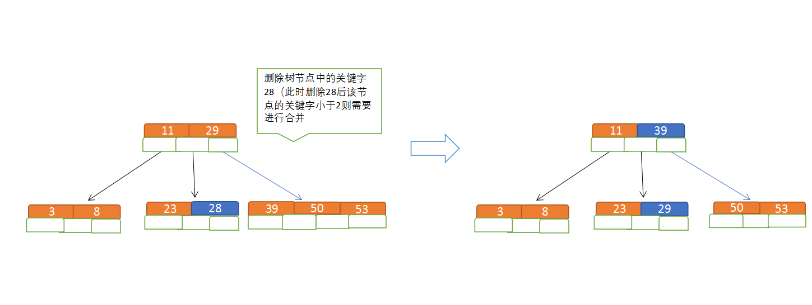

# 树

> **概念**
>
> 由n（n>0）个有限节点组成一个具有层次关系的集合。
>
> **特点：**
>
> 每个节点有零个或多个子节点；
>
> 没有父节点的节点称为根节点；
>
> 每一个非根节点有且只有一个父节点；
>
> 除了根节点外，每个子节点可以分为多个不相交的子树；

> **有序树和无序树：**
>
> 无序树：树中任意节点的子节点之间没有顺序关系，也称自由树；
>
> 有序树：树中任意节点的子节点之间有顺序关系
>
> **相关术语**
>
> 节点的度：一个节点含有的子树的个数称为该节点的度；
>  树的度：一棵树中，最大的节点的度称为树的度；
>  叶节点或终端节点：度为零的节点；
>  非终端节点或分支节点：度不为零的节点；
>  父亲节点或父节点：若一个节点含有子节点，则这个节点称为其子节点的父节点；
>  孩子节点或子节点：一个节点含有的子树的根节点称为该节点的子节点；
>  兄弟节点：具有相同父节点的节点互称为兄弟节点；
>  节点的层次：从根开始定义起，根为第1层，根的子节点为第2层，以此类推；
>  树的高度或深度：树中节点的最大层次；
>  堂兄弟节点：父节点在同一层的节点互为堂兄弟；
>  节点的祖先：从根到该节点所经分支上的所有节点；
>  子孙：以某节点为根的子树中任一节点都称为该节点的子孙。
>  森林：由m（m>=0）棵互不相交的树的集合称为森林；

## 二叉树

> 二叉树是一种特殊的有序树：每个节点至多有两个分支（子节点），分支具有左右次序，不能颠倒。
>
> **两种特殊的二叉树：**
>
> 完全二叉树：除最后一层外，若其余层都是满的，并且最后一层或者是满的，或者是在右边缺少连续若干节点（注意是右边，而不能是左边缺少）。
>
> 满二叉树：每一层都是满的（除了最后一层，这里的最后一层是指叶节点）

## 二叉搜索（查找）树

> 1. 若任意节点的左子树不空，则左子树上所有结点的值均小于它的根结点的值；
> 2. 若任意节点的右子树不空，则右子树上所有结点的值均大于它的根结点的值；
> 3. 任意节点的左、右子树也分别为二叉查找树；
> 4. 没有键值相等的节点。

## 平衡树

> 平衡树是一种改进的二叉查找树，一般的二叉查找树的查询复杂度是跟目标结点到树根的距离（即深度）有关，因此当结点的深度普遍较大时，查询的均摊复杂度会上升，为了更高效的查询，平衡树应运而生了。
>
> 在这里，平衡指所有叶子的深度趋于平衡，更广义的是指在树上所有可能查找的均摊复杂度偏低。朴素的理解：普通二叉查找树，在新增/删除等操作后，会变得又高又瘦，会让查找/新增/删除操作的时间复杂度变大，而平衡二叉树在新增/删除等操作后依然会保持矮矮胖胖的形态，使树的高度维持在log n附近。这种形态就是平衡，会使查找速度更快。为什么能够保持这种好身材呢？通过在新增/删除时的旋转（左旋和右旋）。

> **常见的平衡树：**
>
> AVL树、Treap、伸展树、红黑树、加权平衡树、2-3树、AA树、替罪羊树、节点大小平衡树

## 红黑树

> 红黑树（Red–black tree）是一种自平衡二叉查找树。
>
> 它的操作有着良好的最坏情况运行时间，并且在实践中是高效的：它可以在O(log *n*)时间内做查找，插入和删除，这里的*n*是树中元素的数目。
>
> **性质：**
>
> - 节点是红色或黑色。
>- 根是黑色。
> - 所有叶子都是黑色（叶子是NIL节点）。
>- 每个红色节点必须有两个黑色的子节点。（从每个叶子到根的所有路径上不能有两个连续的红色节点。）
> - 从任一节点到其每个叶子的所有简单路径都包含相同数目的黑色节点。
>
> 

# B树

>  - **概念：**
>
>  B树和平衡二叉树稍有不同的是B树属于多叉树又名平衡多路查找树（查找路径不只两个），数据库索引技术里大量使用者B树和B+树的数据结构，让我们来看看他有什么特点;
>
>  - **规则：**
>
>  （1）排序方式：所有节点关键字是按递增次序排列，并遵循左小右大原则；
>
>  （2）子节点数：非叶节点的子节点数>1，且<=M ，且M>=2，空树除外（注：M阶代表一个树节点最多有多少个查找路径，M=M路,当M=2则是2叉树,M=3则是3叉）；
>
>  （3）关键字数：枝节点的关键字数量大于等于ceil(m/2)-1个且小于等于M-1个（注：ceil()是个朝正无穷方向取整的函数 如ceil(1.1)结果为2);
>
>  （4）所有叶子节点均在同一层、叶子节点除了包含了关键字和关键字记录的指针外也有指向其子节点的指针只不过其指针地址都为null对应下图最后一层节点的空格子;
>
>  
>
>  最后我们用一个图和一个实际的例子来理解B树（这里为了理解方便我就直接用实际字母的大小来排列C>B>A）
>
>  
>
>  
>
>  - **B树的查询流程：**
>
>  
>
>  如上图我要从上图中找到E字母，查找流程如下
>
>  （1）获取根节点的关键字进行比较，当前根节点关键字为M，E<M（26个字母顺序），所以往找到指向左边的子节点（二分法规则，左小右大，左边放小于当前节点值的子节点、右边放大于当前节点值的子节点）；
>
>  （2）拿到关键字D和G，D<E<G 所以直接找到D和G中间的节点；
>
>  （3）拿到E和F，因为E=E 所以直接返回关键字和指针信息（如果树结构里面没有包含所要查找的节点则返回null）；
>
>  
>
>  - **B树的插入节点流程**
>
>  
>
>  定义一个5阶树（平衡5路查找树;），现在我们要把3、8、31、11、23、29、50、28 这些数字构建出一个5阶树出来;
>
>  遵循规则：
>
>  （1）节点拆分规则：当前是要组成一个5路查找树，那么此时m=5,关键字数必须<=5-1（这里关键字数>4就要进行节点拆分）；
>
>  （2）排序规则：满足节点本身比左边节点大，比右边节点小的排序规则;
>
>  先插入 3、8、31、11
>
>  
>
>  
>
>  
>
>  再插入23、29
>
>  
>
>  
>
>  再插入50、28
>
>  
>
>  
>
>  
>
>  - **B树节点的删除**
>
>  
>
>  **规则：**
>
>  
>
>  （1）节点合并规则：当前是要组成一个5路查找树，那么此时m=5,关键字数必须大于等于ceil（5/2）（这里关键字数<2就要进行节点合并）；
>
>  （2）满足节点本身比左边节点大，比右边节点小的排序规则;
>
>  （3）关键字数小于二时先从子节点取，子节点没有符合条件时就向向父节点取，取中间值往父节点放；
>
>  
>
>  
>
>  **特点：**
>
>  B树相对于平衡二叉树的不同是，每个节点包含的关键字增多了，特别是在B树应用到数据库中的时候，数据库充分利用了磁盘块的原理（磁盘数据存储是采用块的形式存储的，每个块的大小为4K，每次IO进行数据读取时，同一个磁盘块的数据可以一次性读取出来）把节点大小限制和充分使用在磁盘快大小范围；把树的节点关键字增多后树的层级比原来的二叉树少了，减少数据查找的次数和复杂度;
>
>  

## B+树

> - **概念**
>
> B+树是B树的一个升级版，相对于B树来说B+树更充分的利用了节点的空间，让查询速度更加稳定，其速度完全接近于二分法查找。为什么说B+树查找的效率要比B树更高、更稳定；我们先看看两者的区别
>
> - **规则**
>
> （1）B+跟B树不同B+树的**非叶子**节点不保存关键字记录的指针，只进行数据索引，这样使得B+树每个**非叶子**节点所能保存的关键字大大增加；
>
> （2）B+树**叶子**节点保存了父节点的所有关键字记录的指针，所有数据地址必须要到叶子节点才能获取到。所以每次数据查询的次数都一样；
>
> （3）B+树叶子节点的关键字从小到大有序排列，左边结尾数据都会保存右边节点开始数据的指针。
>
> （4）非叶子节点的子节点数=关键字数（来源百度百科）（根据各种资料 这里有两种算法的实现方式，另一种为非叶节点的关键字数=子节点数-1（来源维基百科)，虽然他们数据排列结构不一样，但其原理还是一样的Mysql 的B+树是用第一种方式实现）;
>
> 
>
> - **特点**
>
> 1、B+**树的层级更少**：相较于B树B+每个**非叶子**节点存储的关键字数更多，树的层级更少所以查询数据更快；
>
> 2、B+**树查询速度更稳定**：B+所有关键字数据地址都存在**叶子**节点上，所以每次查找的次数都相同所以查询速度要比B树更稳定;
>
> 3、B+**树天然具备排序功能：**B+树所有的**叶子**节点数据构成了一个有序链表，在查询大小区间的数据时候更方便，数据紧密性很高，缓存的命中率也会比B树高。
>
> 4、B+**树全节点遍历更快：**B+树遍历整棵树只需要遍历所有的**叶子**节点即可，，而不需要像B树一样需要对每一层进行遍历，这有利于数据库做全表扫描。
>
> **B树**相对于**B+树**的优点是，如果经常访问的数据离根节点很近，而**B树**的**非叶子**节点本身存有关键字其数据的地址，所以这种数据检索的时候会要比**B+树**快。