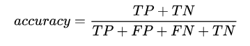
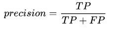
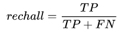
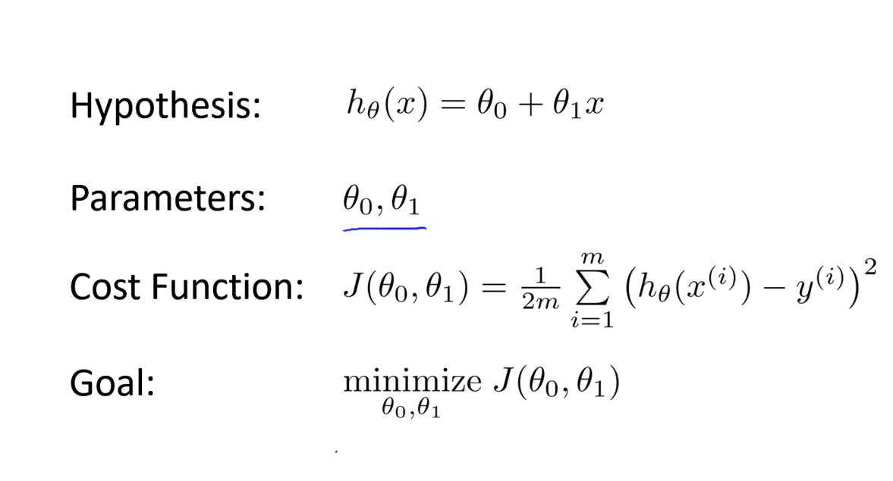
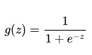
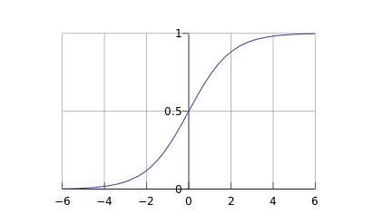
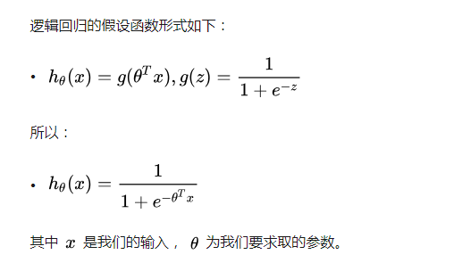
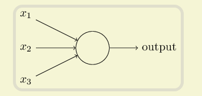
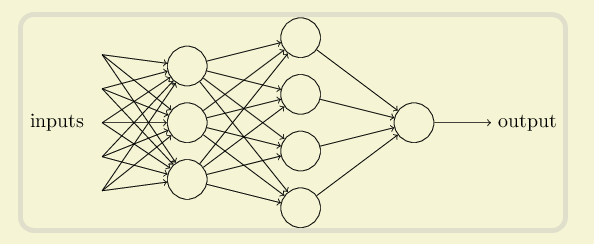
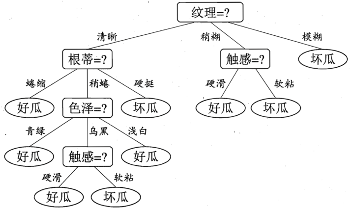

## 1. 分类问题，回归问题

| 特征     | 分类问题（监督学习） | 回归问题                            |
| -------- | -------------------- | ----------------------------------- |
| 输出类型 | 离散数据             | 连续数据                            |
| 目的     | 寻找决策边界         | 找到最优拟合                        |
| 评价方法 | 精度，混淆矩阵       | SSE（sum of square errors）或拟合度 |

​		混淆矩阵：

​			 True Positive(真正，TP)：将正类预测为正类数

​			True Negative(真负，TN)：将负类预测为负类数

​			False Positive(假正，FP)：将负类预测为正类数误报 (Type I error)

​			False Negative(假负，FN)：将正类预测为负类数→漏报 (Type II error)

准确率：

精确率：

召回率：

## 2. 监督学习与非监督学习

​		监督学习 ： 从有标记的训练数据中推导出预测函数。每个训练实例都包括输入和期望的输出

​		非监督学习 ： 从无标记的训练数据中推断结论。

​		最典型的无监督学习就是聚类分析，它可以在探索性数据分析阶段用于发现隐藏的模式或者对数据进行分组。

## 3. 代价函数

  训练中，要尽量减少预测值与实际值的方差，即使得代价函数（代价平方误差代价函数）的值最小

   代价函数与损失函数：

损失函数是定义在单个训练样本上的，也就是算一个样本的误差。即预测值与实际值的误差

代价函数是定义在整体训练集上面的，所有样本误差的总和的平均，也就是损失函数总和的平均

## 4. 梯度下降

​		梯度下降是一种求函数最小值的算法，我们使用梯度下降来计算代价函数的最小值。

​		**思想：** 开始时，随机选择一个参数的组合（a,b），计算代价函数，然后寻找下一个能让代价函数值下降最多的参数组合。循环这么做，直到找到一个局部最小值。

 		梯度下降找到的最小值有可能是局部最小值，而不是全局最小值。

​		**学习率：** a，学习率决定了在梯度下降时，往下降程度最大的方向下多大。

​						a 太小：函数收敛会很慢，需要迭代更多的次数才能找到全局最小值

​						a 太大：可能会越过最小值，导致无法收敛，甚至发散。

​		**选择学习率：** 尝试不同的学习率，对loss值的情况，适当调整

​		通常可以尝试这些学习率：𝛼 = 0.01，0.03，0.1，0.3，1，3，10 

## 5. 特征缩放

​		不同特征的值的范围不同，如果两个特征值范围相差很大，比如一个是 0- 2000，一个是 0-5，n那么代价函数的等高线会很扁，梯度下降需要迭代很多次才能收敛。

可以尝试将所有的特质值缩放到 -1 到 1之间。即 特质的归一化。

## 6. 逻辑回归

​		逻辑回归是一种用于解决二分类问题的机器学习方法。

​		Sigmoid函数，也称为逻辑函数（Logistic function）：

## 7. 欠拟合，过拟合

​		欠拟合： 不能很好的适应训练集，代价函数误差较大

​		过拟合： 过于适应训练集数据，代价函数误差已经很小，但是对于新的测试数据预测性很差

## 8. 神经网络

​		神经元（感知器）：

​		上图的圆圈就代表一个感知器。它接受多个输入（x1，x2，x3...），产生一个输出（output）

权重和阈值：

​		不同的输入，对结果的影响程度不同，则可以设置不同的权重来控制。

决策模型：

​		由多个感知器构成的一个简单决策模型。

# 机器学习常用算法

**1. 线性回归**

​		y = a + b * x

**2. 逻辑回归，用于二分类问题**

**3. 线性判别分析 **

​		解决多分类问题的线性分类技术

​		预测结果是通过计算每个类别的判别值、并将类别预测为判别值最大的类而得出的。该技术假设数据符合高斯分布（钟形曲线），因此最好预先从数据中删除异常值。LDA 是一种简单而有效的分类预测建模方法。

计算多个类别的均值，方差，选取最接近的类型

**4. 决策树：分类树和回归树**

​		决策树模型是运用于分类以及回归的一种树结构。

​		决策树的叶子结点包含一个用于做出预测的输出变量（y）。预测结果是通过在树的各个分叉路径上游走，直到到达一个叶子结点并输出该叶子结点的类别值而得出。

**5. 朴素贝叶斯**

**6. K邻近算法**

​		计算新数据在整个训练集中，最相似的K个实例，并总结这K个实例的输出变量，从而获得预测结果。

**7. 学习向向量化**

**8. 支持向量机SVM（Support Vector Machine）**

​		寻找最终通过超平面得到最佳类别分割系数。即 找出能将所有输入按类别分类的最佳分割超平面。

**9. 随机森林**

​		随机森林顾名思义，是用随机的方式建立一个森林，森林里面有很多的决策树组成，随机森林的每一棵决策树之间是没有关联的。

​		随机森林由决策树组成，决策树实际上是将空间用超平面进行划分的一种方法，每次分割的时候，都将当前的空间一分为二。

**10.Boosting 和 AdaBoost**

​		boosting 是一种将弱分类器转化为强分类器的方法统称，而adaboost是其中的一种，采用了exponential loss function（其实就是用指数的权重）