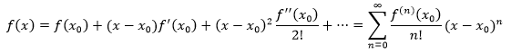
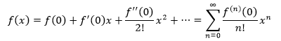
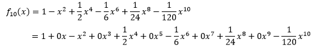
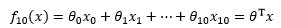

**训练原理**

> ​	卷积神经网络的训练过程就是对大量带标签数据（监督学习）通过**反向传播算法**学习网络结构中的参数。其基本思想是：基于一组设置的初始化模型参数，比如利用高斯分布来随机初始化网络结构中的参数，输入数据在卷积神经网络中经过前向传播会得到一个期望输出，如果这个期望输出与数据的实际类别标签不相同，则将误差逐层反向传播至输入层，每层的神经元会根据该误差对网络结构中的参数进行更新。对卷积神经网络而言，待学习的参数包括卷积核参数、层间的连接参数以及各层的偏置。训练好的模型能够计算新输入数据对应的类别标签，从而完成分类或预测任务。

**数学层面理解深度学习**

> 泰勒公式
>
> 
>
> **在0点处的泰勒展开**  在使用泰勒公式时，经常取x0=0
>
> 
>
> **多项式函数**
>
> 理解了泰勒公式后，再回到问题的原点，看看多项式函数为什么可以接近于任何函数。
>
> 在x0 = 0点处的10阶泰勒展开是：
>
> 
>
> 如果将每一项中的xi都看作一个维度，那么这个多项式函数可以写成多元线性回归的形式：
>
> 

