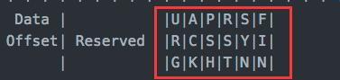

**位码TCP标志位**

就是下图中的红框的内容

- **SYN(synchronous建立联机)：建立连接，发送一方告知另外一方，请求建立连接**
- **ACK(acknowledgement 确认)：该包中有回复信息**
- **PSH(push传送)：该包中有传输信息**
- **FIN(finish结束)：结束位，发送一方告知另外一方，请求中断连接**
- **RST(reset重置)：重置位，这个包是用来要对方重置连接**
- **URG(urgent紧急)：紧急位，已经建议弃用**

原文：https://zhenbianshu.github.io/2018/12/talk_about_tcp_timewait.html

## TIME_WAIT

------

#### 定义

我们从上面的图中可以看出来，当 TCP 连接主动关闭时，都会经过 TIME_WAIT 状态。而且我们在机器上 curl 一个 url 创建一个 TCP 连接后，使用 ss 等工具可以在一定时长内持续观察到这个连续处于 TIME_WAIT 状态。

所以TIME_WAIT 是这么一种状态：TCP 四次握手结束后，连接双方都不再交换消息，但主动关闭的一方保持这个连接在一段时间内不可用。

那么，保持这么一个状态有什么用呢？

#### 原因

上文中提到过，对于复杂的网络状态，TCP 的实现提出了多种应对措施，TIME_WAIT 状态的提出就是为了应对其中一种异常状况。

为了理解 TIME_WAIT 状态的必要性，我们先来假设没有这么一种状态会导致的问题。暂以 A、B 来代指 TCP 连接的两端，A 为主动关闭的一端。

- 四次挥手中，A 发 FIN， B 响应 ACK，B 再发 FIN，A 响应 ACK 实现连接的关闭。而如果 A 响应的 ACK 包丢失，B 会以为 A 没有收到自己的关闭请求，然后会重试向 A 再发 FIN 包。

  如果没有 TIME_WAIT 状态，A 不再保存这个连接的信息，收到一个不存在的连接的包，A 会响应 RST 包，导致 B 端异常响应。

  此时， TIME_WAIT 是为了保证全双工的 TCP 连接正常终止。

- 我们还知道，TCP 下的 IP 层协议是无法保证包传输的先后顺序的。如果双方挥手之后，一个网络四元组（src/dst ip/port）被回收，而此时网络中还有一个迟到的数据包没有被 B 接收，A 应用程序又立刻使用了同样的四元组再创建了一个新的连接后，这个迟到的数据包才到达 B，那么这个数据包就会让 B 以为是 A 刚发过来的。

  此时， TIME_WAIT 的存在是为了保证网络中迷失的数据包正常过期。

由以上两个原因，TIME_WAIT 状态的存在是非常有意义的。

#### 时长的确定

由原因来推实现，TIME_WAIT 状态的保持时长也就可以理解了。确定 TIME_WAIT 的时长主要考虑上文的第二种情况，保证关闭连接后这个连接在网络中的所有数据包都过期。

说到过期时间，不得不提另一个概念: 最大分段寿命（MSL, Maximum Segment Lifetime），它表示一个 TCP 分段可以存在于互联网系统中的最大时间，由 TCP 的实现，超出这个寿命的分片都会被丢弃。

TIME_WAIT 状态由主动关闭的 A 来保持，那么我们来考虑对于 A 来说，可能接到上一个连接的数据包的最大时长：A 刚发出的数据包，能保持 MSL 时长的寿命，它到了 B 端后，B 端由于关闭连接了，会响应 RST 包，这个 RST 包最长也会在 MSL 时长后到达 A，那么 A 端只要保持 TIME_WAIT 到达 2MS 就能保证网络中这个连接的包都会消失。

MSL 的时长被 RFC 定义为 2分钟，但在不同的 unix 实现上，这个值不并确定，我们常用的 centOS 上，它被定义为 30s，我们可以通过 `/proc/sys/net/ipv4/tcp_fin_timeout` 这个文件查看和修改这个值。